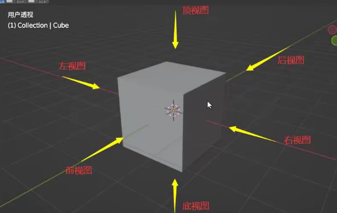
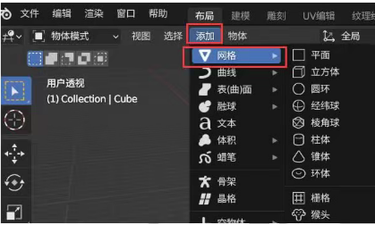
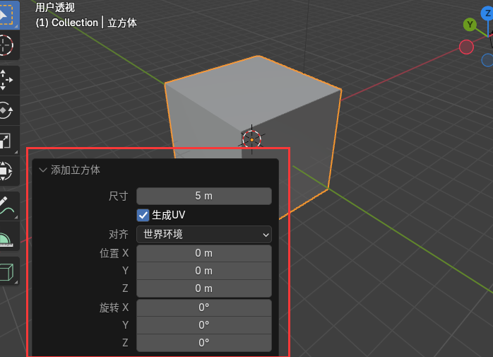
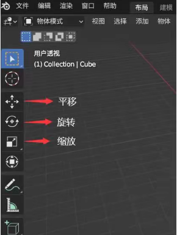

# 基本操作

## 缩放&旋转&平移

- 缩放:上下滚动鼠标中键，可以缩放场景显示的范围
- 旋转:按住鼠标中键不松开，左右拖动、上下拖动，可以转换场景观察角度
- 平移:按住鼠标中键+键盘Shift(不松开),可以上下左右拖动

## 视图切换

- 快捷键反引号按键(ESC下面)，注意在英文输入法按快捷键

- 3D绘图窗口右上角xyz坐标，点击xyz的正半轴或负半轴果网阿

## 选择&删除网格模型

- **选择模型**:鼠标单击可以选择某个模型，选中的模型会有一个发光描边效果。
- **取消选中**:点击选中模型之外区域，选中模型就会被取消选中。
  - 一个模型处于选中状态下，右键弹出菜单，可以删除选中的网格模型，或者快捷键Delete删除。

## 添加网格模型(Mesh)

通过`快捷键Shift + A`,可以快速弹出菜单的添加选项，在弹出界面可以找到网格选项。

创建某个网格模型的时候：

左下角会有一个小弹窗，展开后，可以看到网格模型相关的参数设置，比如位置、尺寸...。

## 旋转&平移&缩放Mesh

绘图窗口左侧有多个工具，比如用于网格模型的平移、旋转、缩放，鼠标点击这些按钮，可以切换到对应的功能。

