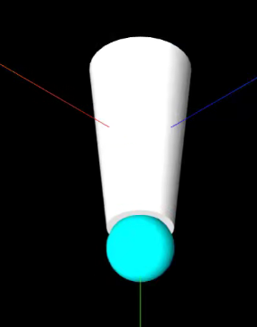
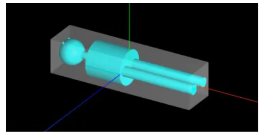
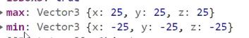
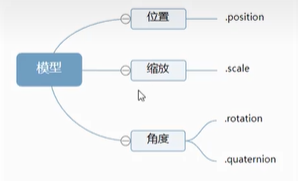
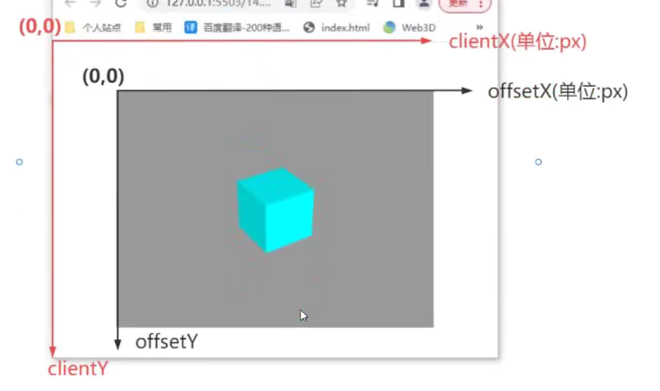
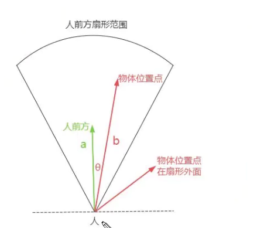
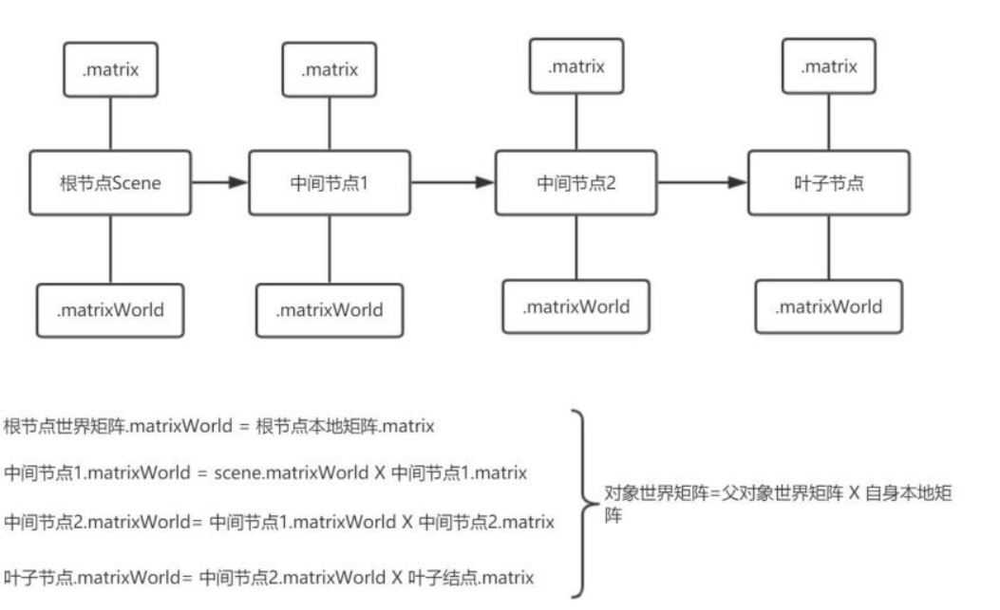

# 场景(scene)

场景能够让你在什么地方、摆放什么东西来交给three.js来渲染,这是放置物体、灯光和摄像机的地方。【==也就是用于绘制的地方==】

```js
const scene = new THREE.Scene();  //通过构造器生成一个场景
//-------------添加物体、灯光等--------------------
const camera = new THREE.PerspectiveCamera(....);
scene.add(camera);   //在场景中添加相机

const cube = new THREE.Mesh('立方体对象','材质');
scene.add(cube); // 将几何体添加到场景中

const light = new THREE.DirectionalLight('颜色', '灯光强度');
light.position.set(-1, 2, 4);  //灯光位置 v3
scene.add(light);  //添加灯光到场景
```

## 对象的移除与添加

```js
'Object3D'.add(子对象)
'Object3D'.remove(子对象)
```

### 模型对象显隐visible

一模型对象的父类Object3D封装了一个属性.visible,通过该属性可以隐藏或显示一个模型。

```js
mesh.visible =false;//隐藏一个网格模型,visible的默认值是true
group.visible =false;//隐藏一个包含多个模型的组对象group
```

# 摄像机(Camera)

## 透视摄像机(PerspectiveCamera)

模拟人眼所看到的景象,它是3D场景的渲染中使用得最普遍的投影模式

第一个参数是**视野角度（FOV）**。视野角度就是无论在什么时候,能在显示器上看到的场景的范围,它的单位是角度(与弧度区分开)。

第二个参数是**长宽比（aspect ratio）**。 相机视锥体水平方向和竖直方向长度比,一般设置为摄像机展示画布宽高比width/height。

剩余两个参数是**近截面**（near）和**远截面**（far）。 当物体某些部分比摄像机的**远截面**远或者比**近截面**近的时候,该这些部分将不会被渲染到场景中。

```js
const camera = new THREE.PerspectiveCamera(
    75,
    window.innerWidth / window.innerHeight,
    0.1,
    1000
);

// 设置相机位置
camera.position.set(0, 0, 10);
```


## lookAt()

lookAt( vector : [Vector3]) 或 lookAt ( x : Float, y : Float, z : Float ) 

- 参数可以是 一个表示世界空间中位置的向量,也可以使用世界空间中[x](http://127.0.0.1:5500/docs/index.html#api/zh/core/Object3D.x)、[y](http://127.0.0.1:5500/docs/index.html#api/zh/core/Object3D.y)和[z](http://127.0.0.1:5500/docs/index.html#api/zh/core/Object3D.z)的位置分量。

- 旋转物体使其在世界空间中面朝一个点。
- 属于基类（Object3D）

结合摄像机可让摄像机照向某一个点或者方向

```js
camera.lookAt(0,0,0) //让摄像机照向原点 【默认值】
//当改变相机的位置时,相机的实现不变,如果需要相机的位置改变时依旧对准一个点,需要在位置改变时设置相机的lookAt
```

## 获取相机视线方向

你通过相机对象的.getWorldDirection()方法,可以快速获取一个沿着相机视线方向的单位向量

```js
const dir = new THREE. Vector3()
//获取相机的视线方向
camera. getWor1dDirection(dir);
console.log(相机方向’, dir);
console.log(’单位向量’, dir.length());
```

### 相机沿着视线方向平移

```js
//dis向量表示相机沿着相机视线方向平移200的位移量
const dis = dir.clone().multiplyScalar (200);
//相机沿着视线方向平移
camera. position.add (dis);
```


## 控件

### 相机轨道控件OrbitControls

OrbitControls 是一个附加组件,必须显式导入

注意：**如果使用OrbitControls,在设置相机焦点时后需要设置.target和lookAt参数是相同坐标,不然OrbitControls依旧会将焦点设置为0,0,0**。

```js
import { OrbitControls } from 'three/addons/controls/OrbitControls.js';
```

```js
const controls = new OrbitControls( camera, renderer.domElement );
//object: （必须）将要被控制的相机。该相机不允许是其他任何对象的子级,除非该对象是场景自身。

//domElement: 用于事件监听的HTML元素。(可选)
```

**注意**：当控制器添加好以后,发现拖动监听区并没有发生任何的渲染改变

- **原因**：摄像头的位置虽然改变了,但是`照片`还是之前的,并没有重新渲染

- **解决方式**：监听摄像头的参数发生改变时,重新渲染

  ```js
    cameraControl.addEventListener('change',()=>{
      renderer.render(scene, camera);
    })
  ```


### 控件观察摄像机位置&焦点

```js
function render() {
    requestAnimationFrame (render);
    //浏览器控制台查看相机位置变化
    console.log(' camera. position', camera. position) ;
    //浏览器控制台查看controls.target变化,辅助设置lookAt参数
    console.log('controls.target', controls.target);
}
render();
```

### 地图导航控件

地图导航相机控件MaControls,可实现一个类似百度也图的3D导航功能【与OrbitControls基本一样】。

```js
import
MapControls } from 'three/addons/controls/OrbitControls.js’';
```

## 正投影相机


正投影相机的长方体可视化空间和透视投影PerspectiveCamera视锥体相似,只是形状不同。


```js
OrthographicCamera( left,right,top,bottom,near,far )
```


```js
const width = window.innerWidth; //canvas画布宽度
const height = window.innerHeight; //canvas画布高度
const k = width / height; //canvas画布宽高比
const s = 600;//控制left, right,top, bottom范团大小
const camera = new THREE. OrthographicCamera(-s *k, s * k,s,-s,1,8000);
```

### 画布大小变化正投影相机更新

```js
window.onresize = function( {
    const width = window.innerwidth; //canvas画布宽度
    const height = window.innerHeight; //canvas画布高度

    //width、height表示canvas画布宽高度
    camera.aspect = width/height;
    //相机的left, right, top,bottom属性变化了,通知threejs系统
    camera.updateProjectionMatrix() ;
};
```

## 相机上方向up

`camera.up`是相机对象的上方向属性

当改变.up属性时候,就好比生活中拍照时候,扭转相机姿态角度进行拍照,这时候照片也会跟着相机姿态旋转。

```js
//.up属性默认值是new THREE.Vector3(0,1,0）,意思是沿着y轴朝上。
camera.up.set(0,-1,0)

//
camera.up.set(O,0,1);//改变up后需要重新执行lookAt
camera.lookAt(0,0,0);//执行lookAt重新计算相机姿态

```

当camera.up为默认值时:

当为(0,-1,0)时：

## 相机管道漫游

```js
import * as THREE from 'three'
const texload=new THREE.TextureLoader()
const texture=texload.load('assets/img/px.jpg')

//绘制圆形
const shape = new THREE.Shape();

//圆弧.arc参数的圆心0,0坐标是相对当前.currentPoint而言,而不是坐标原点
shape.arc(0, 0, 50, 0, Math.PI * 2);
const path1 = new THREE.Path();//圆孔1 
path1.absarc(0,0,40);
shape.holes.push(path1);

//绘制轨迹线
const curve = new THREE.CatmullRomCurve3([
    new THREE.Vector3(-10, -50, -50),
    new THREE.Vector3(-10, 100, -50),
    new THREE.Vector3(20, 200, 0),
    new THREE.Vector3(30, 300, 50),
    new THREE.Vector3(60, 300, 100)
]);

//扫描造型:扫描默认没有倒角
const geometry = new THREE.ExtrudeGeometry(
    shape,//扫描轮廓
    {
        extrudePath: curve,//扫描轨迹
        steps:10000//沿着路径细分精度,越大越光滑
    },

);

const material = new THREE.MeshLambertMaterial({
    color: 'skyblue',
    map:texture,
    side:THREE.DoubleSide,
})

const pathArr=curve.getPoints(100);
const mesh = new THREE.Mesh(geometry, material)
export {mesh,pathArr};
```

```js
if(pathIndex>=pathArr.length-1){
    pathIndex=0
}
const path=pathArr[pathIndex]
camera.position.set(path.x,path.y,path.z);  // 摄像机的位置
pathIndex++
camera.lookAt(pathArr[pathIndex].x,pathArr[pathIndex].y,pathArr[pathIndex].z);
```


## 计算与观察点距离

`controls.getDistance()`可以计算出来相机位置.position和相机目标观察点c:ontrols. targe 的距离。


## 相机可视化

THREE.CameraHelper可以用来可视化正投影相机、透视投影相机对象。

## 包围盒

所谓包围盒Box3,就是一个长方体空间,把模型的所有顶点数据包围在一个最小的长方体空间中,这个最小长方体空间就是该模型的包围盒Box3【可以容纳一个物体的最小体积的盒子】。



包围盒Box3表示三维长方体包围区域,使用min和max两个属性来描述该包围区域：

- Box3的min和max属性值都是三维向量对象Vector3。

- 描述一个长方体包围盒需要通过xyz坐标来表示,

  - X范围[Xmin,Xmax],

  - Y范围[Ymin,Ymax],

  - Z范围[Zmin,Zmax],

    - .min属性值是Vector3(Xmin, Ymin,Zmin) ,

    - .max属性值是Vector3(Xmax,Ymax,Zmin).

```js
const box3 = new THREE.Box3()
console.log('box3' , box3);
box3.min = new THREE.Vector3(-10,-10,0);
box3.max = new THREE.Vector3(100,20,50);
```

### 计算模型最小包围盒

```js
//模型对象,比如mesh或group,作为.expandByObject()的参数,可以计算该模型的包围盒。
const geometry = new THREE.BoxGeometry (50,50,50);
const material =new THREE.MeshLambertMateril({
    color: 0x00ffff,
});
const mesh = new THREE.Mesh(geometry, material);

const box3 = new THREE.Box3();
box3.expandByObject(mesh);// 计算模型包围盒
console.log('查看包围盒', box3);
//浏览器控制台你可以通过.min和.max属性查看模型的包围盒信息。
//其实就是一个记录三维坐标系上最大值的数据,一个记录最小的
```



### 包围盒尺寸

```js
const scale = new THREE.Vector3 ()
// getSize()计算包围盒尺寸
//获得包围盒长宽高尺寸,结果保存在参数三维向量对象scale中
box3.getSize(scale)
console.log('模型包围盒尺寸',scale);
```

### 包围盒几何中心

```js
//Box3方法.getCenter()计算返回包围盒几何中心
//计算包围盒中心坐标
const center = new THREE.Vector3()
box3.getCenter(center)
console.log('模型中心坐标',center) ;
```

### 地图案例


此时会发现,地图不在画布中央,而且大小不合适【可能找不到地图在哪里】

```js
import ditu from '../../assets/posData/data.js'
const posData = [];
ditu.forEach((item) => {
    posData.push(new THREE.Vector2(item[0], item[1]));
})

console.log(posData);
const shape = new THREE.Shape(posData);
const geometry = new THREE.ShapeGeometry(shape);
const material = new THREE.MeshBasicMaterial({ color: 0xffff00 });
const Hmodel = new THREE.Mesh(geometry, material);
```

```js
const getBox = (obj) => {
    const box=new THREE.Box3();
    box.expandByObject(obj);
    const size=new THREE.Vector3();
    const center = new THREE.Vector3()
    box.getCenter(center)
    box.getSize(size);
    return {
        size:size,
        center:center,
    }
}
```

```js
const cameraFn = () => {
    camera = new THREE.PerspectiveCamera(
        75,
        window.innerWidth / window.innerHeight,
        0.1,
        1000
    );
    const box = getBox(mesh)
    //设置相机位置,camera.position.set(box.center.x, box.center.y,0);使得相机正对模型
    //设置相机位置,camera.position.set(0, 0,x+box.size.y)/2);使得模型大小适配画布
    camera.position.set(box.center.x, box.center.y,(box.size.x+box.size.y)/2);
    camera.lookAt(box.center.x, box.center.y, box.center.z);

    //开启并设置相机控件
    cameraControl = new OrbitControls(camera, renderer.domElement);
    //设置相机参数需要更新
    cameraControl.target.set(box.center.x, box.center.y, box.center.z)
    cameraControl.update();
}
```


# 物体绘制

## step1.几何体

创建物体的**==第一步==是声明物体是怎样的几何体**,可以是已经准备好的常见几何体,也可以是自定义顶点的几何体

### 常见集几何体

要创建一个几何体,我们需要一个 几何体对象. 这个对象包含了一个几何体中所有的顶点（**vertices**）和面（**faces**）

Three.js的材质默认正面可见,反面不可见,

- 对于矩形平面PlaneGeometry、圆形平面如果你想看到两面,可以设置`side: THREE. DoubleSide`.

```js
//BoxGeometry:
const geometry = new THREE.BoxGeometry(100,100,100);//立方体
const geometry = new THREE.SphereGeometry(50); //球体
const geometry = new THREE.CylinderGeometry (50,50,100);// 圆柱
const geometry = new THREE.PlaneGeometry(100,50);// PlaneGeometry:矩形平面
const geometry = new THREE.CircleGeometry (50);//圆形平面
 
```

### 缓冲类型几何体

threejs的长方体BoxGeometry、球体SphereGeometry等几何体都是基于BufferGeometry类构建的。

`BufferGeometry`是一个<span style="color:red">没有任何形状的==**空**==几何体</span>,可以通过BufferGeometry自定义任何几何形状,具体一点说就是定义顶点数据。

```js
const geometry = new THREE.BufferGeometry () ;
```

#### 添加顶点

1. 通过javascript类型化数组`Float32Array`创建一组xyz坐标数据用来表示几何体的顶点坐标。
2. 通过threejs的属性缓冲区对象`BufferAttribute`表示threejs几何体顶点数据。
3. 通过geometry.attributes.position设置几何体顶点位置属性的值BufferAttribute.

```js
const vertices =new Float32Array ([
    0,0,0,//顶点1坐标
    50,0,0,//顶点2坐标
    0,100,0, //顶点3坐标
    0,0,10,//顶点4坐标
    0,0,100,//顶点5坐标
    50,0,10,//顶点6坐标
]);
const geometry = new THREE.BufferGeometry() ;//创建一个空几何体,需要顶点、材质来确定形状
cons attribute = new THREE.BufferAttribute(vertices,3);  //这里的3 的意思是 vertices这个数组中每3个数组为一组作为顶点

geometry.attributes.position= attribute;
```

#### 构建矩形

为了构建一个矩形,定义了两个同样逆时针的三角形【计算机图形的基本单位】,进行拼接才可以得到一个矩形

```js
const vertices = new Float32Array([
    0, 0, 0,//顶点1坐标
    50, 0, 0,//顶点2坐标
    50, 50, 0, //顶点3坐标
    
    0, 0, 0,//顶点4坐标
    50, 50, 0,//顶点5坐标
    0, 50, 0,//顶点6坐标
  ]);//两个相同方向的顶点形成的三角形形成的矩形
  const geometry = new THREE.BufferGeometry () ;
  const attribute = new THREE.BufferAttribute(vertices, 3);  //这里的3 的意思是 vertices这个数组中每3个数组为一组作为顶点

  geometry.attributes.position = attribute;

  const material = new THREE.MeshBasicMaterial({
    color: 0xfffff00,
    size: 10,
    side:THREE.DoubleSide
  })
  //定义了一个模型对象
  const mesh = new THREE.Mesh(geometry, material);
```

#### 顶点索引

重过javascript类型化数组Uint16Array创建`顶点索引.index`数据。

```js
const indexes = new Uint16Array([
//下面索引值对应顶点位置数据中的顶点坐标0, 1,2,0,2,3,
])
```

```js
  const vertices = new Float32Array([
    0, 0, 0,//顶点1坐标
    50, 0, 0,//顶点2坐标
    50, 50, 0, //顶点3坐标

    0, 50, 0,//顶点6坐标
  ]);

  const geometry = new THREE.BufferGeometry();  //声明空几何体
  const attribute = new THREE.BufferAttribute(vertices, 3);  //这里的3 的意思是 vertices这个数组中每3个数组为一组作为顶点
  geometry.attributes.position = attribute;


  //定义顶点索引
  const idnexs = new Uint16Array([
    0, 1, 2,
    0, 2, 3
  ])

  //将顶点索引赋值给几何体,并声明1个索引为一个顶点坐标
  geometry.index = new THREE.BufferAttribute(idnexs, 1)
```

#### 顶点法线

之前几何体顶点位置数据通过`geometry.attributes.position`赋值,

方法2：顶点法线(法向量)数据`geometry.attributes.normal`【平面的垂直线】。

注意:

- 在前面使用缓冲类型几何体时,由于==使用的是基础网格材质,所以没有设置顶点法线,**几何体也可以显示**==。
- ==如果使用的是如**MeshLambertMaterial**等受光照影响的材质,不设置顶点法线则**无法显示**==。【法线的方向会影响光照效果】
- 顶点法线通过 三角形（图形最小单位）的三个顶点来设置。

```js
  const vertices = new Float32Array([
    0, 0, 0,//顶点1坐标
    50, 0, 0,//顶点2坐标
    50, 50, 0, //顶点3坐标
    0, 50, 0,//顶点6坐标
  ]);

//-------省略

//定义顶点法线,与顶点坐标需要一一对应
const normals = new Float32Array([
    0, 0, 1,
    0, 0, 1,
    0, 0, 1,
    0, 0, 1,
])

geometry.attributes.normal = new THREE.BufferAttribute(normals, 3)
```

#### 三维向量表示顶点

- 用三维向量Vector3表示顶点的x、y、z坐标,作为数组元素创建一组顶点坐标。
- `setFromPoints()`是几何体BufferGeometry的一个方法,通过该方法可以把数组pointsArr中坐标数据提取出来赋值给几何体。

```js
const pointsArr = [
    //三维向量Vector3表示的坐标值
    new THREE.Vector3(0,0,0),
    new THREE.Vector3(0,100,0),
    new THREE.Vector3(0,100,100),
    new THREE.Vector3(0,0,100),
]
```

```js
geometry.setFromPoints(pointsArr);
```


### 几何体的细分数

Three.js很多几何体都提供了细分数相关的参数,这里以矩形平面几何体PlaneGeometry为例。

**矩形平面几何体至少需要两个三角形拼接而成**。

```js
//矩形几何体PlaneGeometry的参数3,4分别表示垂直、水平细分数,默认是1,1
const geometry = newTHREE.PlaneGeometry(100,50,1,1);
//把一个矩形分为2份,每个矩形2个三角形,总共就是4个三角形
const geometry = new THREE.PlaneGeometry (100,50,2,1);

//把一个矩形分为4份,每个矩形2个三角形,总共就是8个三角形
const geometry = new THREE. PlaneGeometry(100,50,2,2);

```

球体`SphereGeometry`参数2、3分别代表宽、高度两个方向上的细分数,

默认32,16,具体多少以所用版本为准。

```js
const geometry = new THREE. SphereGeometry( 50,32,16 );
//如果球体细分数比较低,表面就不会那么光滑。
const geometry = new THREE.SphereGeometry( 15,8,8 );

```


### 几何体的基本操作

对几何体本身进行缩放、平移、旋转,这些方法本质上都是改变几何体的顶点数据。


补充：**居中**：

```js
//已经偏移的几何体居中,执行.center(),可以看到几何体重新与坐标原点重合
geometry.center();
```

### 几何体颜色

#### 几何体顶点颜色渐变

- 顶点颜色`attributes.color`.
- 顶点位置数据geometry.attributes.position.
- 顶点法向量数据geometry.attributes.normal.
- 顶点UV数据geometry.attributes.uv.
- 

```js
const geometry = new THREE.BufferGeometry();//创建一个几何体对象
const vertices = new Float32Array([
    0,0,0,//顶点1坐标
    50,0,0,//顶点2坐标
    0,25,0,//顶点3坐标
]);
//顶点位置
geometry.attributes,. positon = new THREE. BufferAttribute(vertices,3);
```

与几何体BufferGeometry顶点位置数据.attributes.position——对应的顶点颜色数据.attributes.color。

```js
const colors = new Float32Array([
    1,0,0,//顶点1颜色
    0,0,1,//顶点2颜色
    0,1,0,//顶点3颜色
])
//设置几何体attributes属性的颜色color属性
//3个为一组,表示一个顶点的颜色数据RGB
geometry.attributes.color = new THREE. BufferAttribute(colors,3;
```

**顶点渲染**：

```js
const material = new THREE.PointsMaterial({
    // color: 0x333333, //使用顶点颜色数据,color属性可以不用设置
    vertexColors:true,//默认false,设置为true表示使用顶点颜色渲染
    size: 20.0,//点对象像素尺寸
});
const points = new THREE.Points (geometry,material);//点模型对象
```

#### Color对象颜色渐变插值

**插值方法.lerpColors()**：
执行`.lerpColors(Color1,Color2,percent)`通过一个百分比参数percent,可以控制Color1和Color2两种颜色混合的百分比,

- Color1对应1-percent, 
- Color2对应2-percent。

```js
//其实就是将两种指定颜色 按照给出百分比混合出新的颜色
const cl = new THREE.Color(Oxff0000);
//红色const c2 = new THREE.Color(Ox0000ff);
//蓝色const c = new THREE.Color() ;
c.lerpColors(c1, c2,0.5);
console.log(颜色插值结果’, c);
```

.**lerp()**：

```js
//.lerp()和.lerpColors()功能一样,只是具体语法细节不同。
//c1与c2颜色混合,混合后的rgb值,赋值给c1的.r、.g、.b属性。
const c1 = new THREE.Color(Oxff0000);//红色
const c2 = new THREE.Color (Ox0000ff);//蓝色
c1.lerp(c2, percent);

```

注意：颜色对象也可以通过`clone`克隆


## step2.材质

第二步,==为物体声明**连接顶点**的材质==,可以是点、线、面等等

对于一个几何体对象,需要提供一种**材质**来为其提供表面的素材以及颜色

**补充**：`材质属性.wireframe`,线条模式渲染,查看几何体三角形结构,==让图形以最小单位三角形显示==。

```js
//这里使用的材质（MeshPhongMaterial）是一种用于具有镜面高光的光泽表面的材质,并设置了材质的颜色
//基础材质不受关照影响
  const cubeMaterial = new THREE.LineBasicMaterial({ 
    color: 0xffff00 ,
    transparent:true,   //开启透明
    opacity:0.5         //设置透明度
  });
```

### 网格高光材质（MeshPhongMaterial）

MeshPhongMaterial对光照反射特点：

- `MeshPhongMaterial`和`MeshLambertMaterial` 都会收到光照的影响区别在于,对光线反射方式有差异。
  - 对高光效果,可以想象一下,在太阳下面观察一辆车,会发现在特定角度和位置,可以看到车表面某个局部区域非常高亮。

- `MeshPhongMateri`可以实现`MeshLambertMaterial`不能实现的高光反射效果。


### 材质父类Material

MeshPhysicalMaterial清漆层.clearcoat

## step3.物体模型

第三步,将几何体、材质作为参数,创建一个具体的物体对象

### 网格模型(Mesh)

#### 网格材质


在拥有了几何体对象以及用于几何体的材质以后,最终需要将其生成一个物体实例

```js
//生成网格对象后,就可以将其放入场景中用于观察以及操作了
const cubeGeometry = new THREE.BoxGeometry(5, 5, 5); //三个参数分别是长宽高
const cubeMaterial = new THREE.MeshPhongMaterial({ color: 0xffff00 });
const mesh = new THREE.Mesh( cubeGeometry, cubeMaterial );
scene.add( mesh );


//批量添加
let arr = [];
const cubeGeometry = new THREE.BoxGeometry(5, 5, 5);
const cubeMaterial = new THREE.MeshLambertMaterial({
    color: 0xffff00,
    transparent:true,
    opacity:0.5
});
for (let i = -5; i < 5; i++) {
    for (let j = -5; j <5; j++) {
        let meshSon = new THREE.Mesh(cubeGeometry, cubeMaterial);
        meshSon.position.set(i * 8, 5, j * 8)
        arr.push(meshSon)
    }
}

// scene.add(mesh);
scene.add(...arr);
```


**镜面反射与漫反射**：

`MeshPhongMaterial`可以提供一个镜面反射效果,可以类比你生活中拿一面镜子,放在太阳光下,调整角度,可以把太阳光反射到其它地方,如果反射光对着眼睛,也就是反射光线和视线平行的时候,会非常刺眼。

`MeshLambertMaterial`对应的Mesh受到光线照射,没有镜面反射的效果,只是一个漫反射,也就是光线向四周反射。

```js
const cubeMaterial = new THREE.MeshPhongMaterial({
    color: 'red',
    shininess:50,  //设置反射强度
    specular : 'red', // 高光颜色属性
    // transparent:true,
    // opacity:0.5
});
```

### 点模型point

点模型Points和网格模型Mesh一样,都是threejs的一种模型对象,只是大部分情况下都是Mesh表示物体。

网格模型Mesh有自己对应的材质同样点模型Points有自己对应的点材质`PointsMaterial`.

```js
//创建点模型材质
const material = new THREE.PointsMaterial({
color:0xfffffee,
size:10,
})
//定义了一个点模型对象
const points = new THREE.Points(geometry,material); .

```

### 线模型Line

相对于点模型将顶点渲染成点,线模型则是将这些点连接起来

```js
//LineBasicMaterial  基础线材质、还有其他的材质比如虚线

//闭合线条,最后一个点会自行 连接第一个点
const line = new THREE.LineLoop(geometry,material);
//非连续的线条,也就是第一个连接第二个点以后,第二个和第三个之间会跳过,依次按照该规律连接
const line = new THREE.LineSegments(geometry,material);

```

### 物体模型的正反面

正面:逆时针

反面:顺时针

空间中一个三角形有正反两面,如何区分？

你的眼睛(相机)对着三角形的一个面,

- 如果三个顶点的顺序是逆时针方向,该面视为正面,
- 如果三个顶点的顺序是顺时针方向,该面视为反面。【默认反面不可见,可在材质中设置`side: THREE. DoubleSide,//两面可见`】


```js
const vertices = new Float32Array([
    0, 0, 0,//顶点1坐标
    50, 0, 0,//顶点2坐标
    0, 100, 0, //顶点3坐标
    //由于下方声明为三个一组,此时从1 到 3 构成的三角形的顶点顺序是逆时针的连接顺序,因此是正面
    0, 0, 10,
    0, 0, 100,
    50, 0, 10,
]);
const attribute = new THREE.BufferAttribute(vertices, 3);  //这里的3 的意思是 vertices这个数组中每3个数组为一组作为顶点
geometry.attributes.position = attribute;
const material = new THREE.MeshBasicMaterial({
    color: 0xfffff00,
    size: 10,
})
//定义了一个点模型对象
const mesh = new THREE.Mesh(geometry, material);
```

### 角度



模型的角度属性.rotation和四元数属性.quaternion都是表示模型的角度状态,只是表示方法不同,

- .rotation属性值是`欧拉对象Euler`,这个对象有xyz以弧度表示旋转角度

  - ```js
    mesh.rotation.y += Math.PI/6;
    mesh.rotateY(Math.PI/6;)
    ```

- quaternion属性值是是`四元数对象Quaternion`.

### clone&copy

- `clone` 方法用于创建一个与原始对象相同的新对象,新对象是原始对象的一个完全独立的副本,对新对象的任何修改都不会影响原始对象,反之亦然。
- `copy` 方法用于将一个对象的属性复制到另一个对象上,它会覆盖目标对象的现有属性。需要注意的是,`copy` 方法通常不会创建一个新对象,而是修改现有的目标对象。

#### 示例代码

```js
//克隆.clone()简单说就是复制一个和原对象一样的新对象,以三维向量对象Vector3举例,其他的threejs对象都可以参照类似的写法。
const vl = new THREE.Vector3(1,2,3);console.log('vl', v1);
//v2是一个新的Vector3对象,和v1的.x、.y、.z属性值一样
const v2 = v1.clone() ;
console.log('v2', v2);
```

注意：

- 通过克隆.clone()获得的新模型和原来的模型**共享材质和几何体**。

## 三维向量Vector3

**注**:

- 点模型Points、线模型Line、网格网格模型Mesh等模型对象的父类都是Object3D,
- 如果想对这些模型进行旋转、缩放、平移等操作,如何实现,可以查询Threejs文档Object3D对相关属性和方法的介绍。

三维向量Vector3有xyz三个分量,threejs中会用三维向量Vector3表示很多种数据,比如位置.position和缩放.scale属性。

- 查看three.js文档可以知道Vector3对象具有属性x、y、z,
- Vector3对象还具有.set()等方法。

```js
//在文档中可见到.position和.scale等等的值都是Vector3对象,因此可用Vector3的属性以及方法
const v3 = new THREE.Vector3(0,0,0);
console.log('v3', v3);
v3.set(10,0,0) ; //set方法设置向量的值
v3.x = 100;//访问x、y或z属性改变某个分量的值
```

### 平移

```js
//网格模型沿着x轴正方向平移100,可以多次执行该语句,每次执行都是相对上一次的位置进行平移变换。
//等价于mesh. position = mesh. position + 100;
mesh.translateX(100);//沿着x轴正方向平移距离100

//向量Vector3对象表示方向
var axis = new THREE.Vector3(1,1,1);
axis.normalize();//向量归一化,将其转化为单位向量
//沿着axis轴表示方向平移100
mesh.translateOnAxis(axis,100);
```

## 精灵模型

Three.js的精灵模型Sprite和Threejs的网格模型Mesh一样都是模型对象,父类都是0bject3D。

==Sprite与矩形平面Mesh的区别==:当旋转三维场景的时候,如果通过相机控件OrbitControls旋转测试,

- Sprite矩形平面会始终平行于Canvas画布或者说屏幕,
- 矩形平面Mesh的姿态角度会跟着旋转,不一定平行于canvas画布。

### 精灵模型材质

`SpriteMaterial`

```js
cost spriteMaterial = new THREE.SpriteMaterial({
    color:0x00ffff,//设置颜色
}) ;
```

### 创建精灵模型

创建精灵模型对象Sprite和创建网格模型对象一样需要创建一个材质对象,不同的地方在于**创建精灵模型对象不需要创建几何体对象Geometry**。

```js
const sprite = new THREE.Sprite(spriteMaterial);
const mesh = new THREE.Mesh(geometry,material);
```

- 精灵模型Sprite默认是一个矩形形状,默认长宽都是1,默认在坐标原点位置。
- Sprite默认尺寸为1,如果在画布上看不太清,可以适当调整相机参数。
- 对于透视投影相机而言,Sprite和Mesh一样遵循远小近大的投影规律。

### 标注场景案例

精灵材质对象SpriteMaterial和普通的网格材质一样具有颜色贴图.map、开启透明.transparent、透明度. opacity等属性。

```js

const textureCubepoint = new THREE.TextureLoader().load('../../assets/img/光点.png')

const sprite = new THREE.SpriteMaterial({
    // color: 0x00ffff,
    map: textureCubepoint,
    transparent: true,
})

const spriteMesh = new THREE.Sprite(sprite)
spriteMesh.scale.set(10, 10, 1)

sprite.position. set (0,100,0);

export default spriteMesh
```

### 精灵模型模拟下雨等效果

注意：**这种效果实现后,经常出现相机前出现较大的动画,可以尝试设置摄像机的near,将其值设置的更大一些**。

```js
import * as THREE from 'three'
import { GLTFLoader } from 'three/addons/loaders/GLTFLoader.js';

function createSprite() {
    const Group=new THREE.Group()
    const spriteTex = new THREE.TextureLoader().load('../../assets/img/雨滴.png')
    const spriteMaterial = new THREE.SpriteMaterial({
        map: spriteTex,
        transparent: true,
    })


    for(let i=0;i<1000;i++){
        const sprite=new THREE.Sprite(spriteMaterial)
        //雨滴的分布范围
        const x=Math.random()*1000-500
        const y=Math.random()*1000-500
        const z=Math.random()*1000-500
        const scale=Math.random()*10
        sprite.position.set(x,y,z)
        sprite.scale.set(scale,scale*1.2,1)
        Group.add(sprite)
    }

    loop(Group)
    return Group
}


let clock=new THREE.Clock()
function loop(Group){
    const elapsedTime=clock.getDelta() //loop(两次执行时间间隔
    Group.children.forEach((sprite)=>{
        sprite.position.y-=200*elapsedTime
        if(sprite.position.y<-500){
            sprite.position.y=500
        }
    }) 

    requestAnimationFrame(()=>{
        loop(Group)
    })
}


const gltfLoader = new GLTFLoader()
const model = new THREE.Group
const textureCube = new THREE.CubeTextureLoader()
.setPath('../../assets/img/')
.load(['px.jpg', 'nx.jpg', 'py.jpg', 'ny.jpg', 'pz.jpg', 'nz.jpg']);
export const loadmodel = (callback1) => {
    gltfLoader.load('../../assets/工厂.glb', (gltf) => {
        gltf.scene.traverse((child) => {
            if (child.isMesh) {
                child.material.envMap = textureCube;
                child.material.envMapIntensity = 1.0;
                child.castShadow = true;
                child.receiveShadow = true;
            }
        })

        model.add(gltf.scene,createSprite())
        callback1(model)
    })
}
```

### 精灵模型标签函数

```js
function createSprite(obj,state){
    const texLoader = new THREE.TextureLoader();
    let texture = null;
    if(state=="警告"){
        texture = texLoader. load("./警告.png");
    }else{
        texture = texLoader. load("./故障.png");
    }
    const spriteMaterial =new THREE.SpriteMaterial({
        map: texture,
    });
    const sprite = new THREE.Sprite(spriteMaterial);
    sprite.scale.set(5,5,1);
    //标签底部箭头和空对象标注点重合
    sprite.position.y = 5/2;
    obj.add(sprite)
}

```


## PBR材质

PBR就是,基于物理的渲染physically-based rendering。

Three.js提供了两个PBR材质相关的API

- `MeshStandardMaterial`.
- `MeshPhysicalMaterial` .

`MeshPhysicalMaterial`是在`MeshStandardMaterial`基础上扩展出来的子类,除了继承了金属度、粗糙度等属性,还**新增了清漆.clearcoat、透光率.transmission、反射率.reflectivity、光泽.sheen、折射率.ior等等各种用于模拟生活中不同材质的属性**。

### 光照模型

对于实际生活中的光学问题,Three.js会提供一些的光照模型来模拟物体表面的光照,光照模型就一种模拟光照的计算方法,能提供更好的效果,并且更加消耗电脑性能。

**MeshPhysicalMaterial和MeshLambertMaterial一样都是渲染网格模型的材质,但是他们用的光照模型不同,具体点说就是材质模拟Mesh反射光照的代码算法不同,算法不同,自然模拟光照的真实程度也不同**。

整体上来看,就是渲染表现能力越强,占用的计算机硬件资源更多。

- 占用渲染资源：
  - `MeshBasicMaterial` <`MeshLambertMaterial` < `MeshPhongMaterial`< `MeshStandardMaterial` < `MeshPhysicalMaterial`.
- 渲染表现能力：
  - `MeshBasicMaterial` < `MeshLambertMaterial` < `MeshPhongMaterial`<`MeshStandardMaterial `< `MeshPhysicalMaterial`.

### 金属度和粗糙度(金属效果)

PBR材质`MeshStandardMaterial`,`金属度metalness`和`粗糙度roughness` ,

加上环境贴图.envMap ,可以呈现金属渲染效果。

**金属度属性**：

- `.metalness`表示材质像金属的程度,非金属材料,如木材或石材,使用0.0,金属使用1.0。

- threejs的PBR材质,.metalness默认是0.5,0.0到1.0之间的值可用于生锈的金属外观

- ```js
  new THREE.MeshStandardMaterial({
      metalness: 1.0,//金属度属性
  })
  mesh. material.metalness = 1.0;//金属度
  ```


- ```js
  import * as THREE from 'three'
  import { GLTFLoader } from 'three/addons/loaders/GLTFLoader.js';
  
  const loader = new GLTFLoader();
  const model = new THREE.Group();
  loader.load("../../assets/金属.glb", (gltf) => {
      // 将加载的模型添加到 group 中
      gltf.scene.traverse(obj=>{
          if(obj.isMesh){
              console.log(obj.material);
              obj.material.metalness=0.5
          }
      })
      model.add(gltf.scene);
  }, undefined, (error) => {
      // 处理加载错误
      console.error('模型加载失败:', error);
  });
  
  export default model;
  ```

**粗糙度roughness**：

生活中不同物体表面的粗糙程度不同,比如地面比较粗糙,比如镜子表面就非常非常光滑。

`粗糙度roughness`表示模型表面的光滑或者说粗糙程度,越光滑镜面反射能力越强,越粗造,表面镜面反射能力越弱,更多地表现为漫反射。

`粗糙度roughness `:**0表示平滑的镜面反射【==可以模拟镜子==】,1.0表示完全漫反射,默认0.5**。

```js
new THREE. MeshStandardMaterial({
    roughness: 0.5,//表面粗糙度
})
mesh. material.roughness = 0.5;//表面粗糙度
```

### 环境贴图envMad(金属效果)

环境贴图对PBR材质渲染效果影响还是比较大,一般渲染PBR材质的模型,最好设置一个合适的环境贴图。

### 清漆层.clearcoat

清漆层属性.clearcoat可以用来模拟物体表面一层透明图层,就好比在物体表面刷了一层透明清漆喷了点水。

**.clearcoat的范围0到1,默认0**。

```js
const material = new THREE.MeshPhysicalMaterial({
    clearcoat: 1.0,//物体表面清漆层或者说透明涂层的厚度
})
```

#### 清漆层粗糙度.clearcoatRoughness

清漆层粗糙度`clearcoatRoughness`属性表示物体表面透明涂层.clearcoat对应的的粗糙度

**`.clearcoatRoughness`的范围是为0.0至1.0。默认值为0.0**。

```js
const material = new THREE. MeshPhysicalMaterial( {
    clearcoat: 1.0,//物体表面清漆层或者说透明涂层的厚度
    clearcoatRoughness: 0.1,//透明涂层表面的粗糙度
});

```

### 透光率transmission

为了更好的模拟玻璃、半透明塑料一类的视觉效果,可以使用`物理透明度.transmission`属性代替Mesh`普通透明度属性.opacity`。

使用.transmission属性设置Mesh透明度,即便完全透射的情况下仍可保持高反射率。

**物理光学透明度.transmission的值范围是从0.0到1.0。默认值为0.0**。

```js
const mesh = gltf.scene. get0bjectByName('玻璃01')
mesh. material = new THREE.MeshPhysicalMaterial({
    transmission: 1.0,//玻璃材质透光率,transmission替代opacity
})
```

### 折射率ior

**非金属材料的折射率从1.0到2.333。默认值为1.5**。

不同材质的折射率,可以百度搜索。

## 模型闪烁【深度冲突】

也就是模型在进行旋转等操作时,可能出现闪烁的情况

对于模型闪烁的原因简单地说就是深度冲突,对应的英文关键词是`Z-fighting`。

**出现原因**：

- 创建两个重合的矩形平面Mesh,通过浏览器预览,当旋转三维场景的时候,会发现模型渲染的时候产生闪烁。

- 这种现象,主要是两个Mesh重合,电脑GPU分不清谁在前谁在后,这种现象,可以称为深度冲突Z-fighting。

- ```js
  //两个矩形平面Mesh重合,产生闪烁
  //闪烁原因:两个矩形面位置重合,虽然从x,y轴观察长宽不同,但z轴上却在同一位置,从z轴观察时GPU无法分清谁在前谁在后
  const geometry = new THREE.PlaneGeometry(250, 250);
  const material = new THREE.MeshLambertMaterial({
      color: 0x00ffff,
      side: THREE.DoubleSide,
  });
  const mesh = new THREE.Mesh(geometry, material);
  
  const geometry2 = new THREE.PlaneGeometry(300, 300);
  const material2 = new THREE.MeshLambertMaterial({
      color:'pink',
      side: THREE.DoubleSide,
  });
  const mesh2 = new THREE.Mesh(geometry2, material2);
  
  scene.add(mesh, mesh2);
  ```

  

### 相机对深度冲突的影响

**第1步**:设置两个Mesh平面的距离相差0.1,此时没有深度冲突导致的闪烁

**第2步**:

- 改变相机. position属性,会发现当相机距离三维模型较远的时候,两个面也可能出现深度冲突,

- 也可以通过相机控件OrbitControls缩放功能,改变相机与模型的距离,进行观察。

- ```js
  camera. position.set (292*5,223*5,185*5)
  ```

**原因**:

- **透视投影相机的投影规律是远小近大**,和人眼观察世界一样,模型距离相机越远,模型渲染的效果越少,**两个mesh之间的间距同样也会变小**。
- 当两个Mesh和相机距离远到一定程度,两个模型的距离虽然设置成了0.1但距离远时也会无限接近0。

### 设置深度缓冲区

```js
mesh2.position.z =0;
mesh2.position.z = 0.1;
camera. position.set (292*5,223*5,185*5);

const renderer = new THREE.WebGLRenderer({
    //设置对数深度缓冲区,优化深度冲突问题
    logarithmicDepthBuffer: true //两个平面面距过小或者重合时无效
});

```

当一个三维场景中有一些面距离比较近,有深度冲突,

- 可以尝试设置webgl渲染器设置对数深度缓冲区 `logarithmicDepthBuffer: true`来优化或解决。

- `logarithmicDepthBuffer: true`作用简单来说,就是两个面间距比较小的时候,让threejs更容易区分两个面,谁在前,谁在后。

## 模型加载进度条

web3d可视化项目开发,很多时候,3D模型的大小要比普通前端项目的文件大得多,这时候往往需要设置一个进度条,表示模型的加载进度。

```js
loader.load(模型路径,加载完成函数,加载过程函数)
```

模型本身是有大小的,通过浏览器从服务器加载的时候,本身网络传输是需要时间的。

- .load()方法的参数2:是一个函数,参数2函数是模型加载完成以后才会被调用执行。
- .load()方法的参数3:是一个函数,通过函数的参数获取模型加载信息,每当模型加载部分内容,该函数就会被调用,一次加载过程中一般会被调用多次,直到模型加载完成。

```js
export const loadModel=(callback1,callback2)=>{
    //..代码省略
    callback1(Hmodel);
}, xhr=>{
    const percent = xhr.loaded / xhr.total;
    callback2(percent);
}, (error) => {
    // 处理加载错误
    console.error('模型加载失败:', error);
});
}

const meshFn = () => {
    loadModel((Hmodel) => {
        //代码省略
        scene.add(Hmodel);
    },(percent)=>{
        console.log(percent);
    })
}
```


# 灯光

## 基础光Light

光源的基类 - 所有其他的光类型都继承了该类描述的属性和方法。

```js
const color = 0xFFFFFF;
const intensity = 3;
const light = new THREE.DirectionalLight(color, intensity);  //设置灯光颜色以及强度
light.position.set(-1, 2, 4);   //设置光源的灯光方向以及位置
scene.add(light);           
```

## 点光源PointLight

```js
const color = 0xFFFFFF;
const intensity = 3;
const light = new THREE.PointLight( 0xff0000, intensity, 100 );
//color -（可选）一个表示颜色的 Color 的实例、字符串或数字,默认为一个白色（0xffffff）的 Color 对象。
//intensity -（可选）光照强度。默认值为 1。
//distance - 光源照射的最大距离。默认值为 0（无限远）。
//decay - 沿着光照距离的衰退量。默认值为 2。设置为0则不衰减
light.position.set(-1, 2, 4);   //设置光源的灯光方向以及位置
scene.add(light);           
```

### 点光源辅助观察

```js
const lightFn = () => {
    const color = 0xFFFFFF;
    const intensity = 1;
    light = new THREE.DirectionalLight(color, intensity);  //设置灯光颜色以及强度
    light.position.set(4, 4, 4);   //设置光源的灯光方向以及位置
    scene.add(light);
}

/**
* 点光源辅助器
*/
const PointLightHelperFn = () => {
    const sphereSize = 1;
    const pointLightHelper = new THREE.PointLightHelper(light, sphereSize);
    scene.add(pointLightHelper);

}
```


## 环境光AmbientLight

环境光会均匀的照亮场景中的所有物体。环境光不能用来投射阴影,因为它没有方向。

## 平行光DirectionalLight

平行光是沿着特定方向发射的光。这种光的表现像是无限远,从它发出的光线都是平行的

### 平行光的反射

- 平行光照射到**网格模型**Mesh表面,光线和模型表面构成一个入射角度,入射角度不同,对光照的反射能力不同。
- 光线照射到**漫反射网格材质**MeshLambertMaterial对应Mesh表面,Mesh表面对光线反射程度与


## 聚光源SpotLight

聚光源可以认为是一个沿着特定方向会逐渐发散的光源,照射范围在三维空间中构成一个圆锥体。


```js
const spotLight = new TIREE.SpotLight(Oxffffff,1.0);
scene. add(spotL.ight);//光源添加到场景中
```

### 聚光源发散角度

```js
//通过属性. angle可以设置聚光源发散角度,和目标.target两个属性来实现。
spotLight.angle = Math.PI / 6;
```

### 聚光源目标对象

聚光源目标对象.target和光源的位置. position共同确定聚广源照射方向。

浏览器控制台打印聚广源目标对象.target属性,可以看到属性值是一个模型对象0bject3D。

```js
//聚广源目标对象属性的位置通过属性值0bject3D的.position属性设置。
// spotLight.target是一个模型对象0bject3D,默认在坐标原点
spotLight.target. position.set(50,0, 0);
//spotLight. target添加到场景中. target.position才会起作用
scene.add (spotLight.target);
```

## 阴影计算

点光源PointLight、聚光源SpotLight、平行光DirectionalLight等都可以产生阴影,就像实际生活中的影子。

### 平行光阴影计算

平行光DirectionalLight阴影计算最少设置

1. `castShadow`设置产生阴影的模型对象

   - ```js
     //设置产生投影的网格模型
     mesh.castShadow = true;
     ```

2. `castShadow`设置产生阴影的光源对象

   - ```js
     //和产生阴影的模型一样,光源也有阴影投射属性.castShadow属性,光源默认不产生阴影,需要代码开启。
     //平行光
     const directionalLight = new THREE.DirectionalLight(Oxffffff,1);//平行光设置产生阴影的光源对象,开启光源阴影的计算功能
     directionalLight.castShadow = true;
     ```

3. `receiveShadow`设置接收阴影效果的模型

   - ```js
     //模型阴影接收属性.castShadow设置接收阴影的模型对象
     //设置接收阴影的投影面
     planeMesh.receiveShadow = true;
     ```

4. `shadowMap.enabled` WebGI渲染器允许阴影渲染.

   - ```js
     //WebGL的渲染器的阴影贴图属性.shadowMap的属性值是一个对象,
     //.shadowMap具有enabled、 type等属性。
     //设置.shadowMap. enabled=true允许wébGL渲染器渲染阴影。
     //设置渲染器,允许光源阴影渲染
     renderer.shadowMap.enabled = true;
     ```

- `shadow.camera`设置光源阴影渲染范围

  - 平行光`DirectionalLight`的shadow属性是**平行光阴影对象**`DirectionalLightShadow`.

  - **平行光阴影对象**有一个==相机属性==`shadow.camera`。

    - ==相机属性==`shadow.camera`的是一个**正投影相机对象**`OrthographicCamera`。

  - 平行光阴影相机的位置`.shadow.camera.position`默认就是平行光的位置属性`directionalLight.position`。

  - ```js
    console.log('阴影相机属性',,directionalLight.shadow.camera);
    //打印结果OrthographicCamera
    ```

  - ```js
    //.shadow.camera属性值是正投影相机OrthographicCamera,所以.shadow.camera属性的用法可以参考前面讲解过的正投影相机OrthographicCamera。
    //这里相当于设置投影范围
    OrthographicCamera( left, right,top, bottom,near,far)
    //设置投影相机【平行光】位置-平行光阴影相机的位置shadow.camera.position默认就是平行光的位置属性directionalLight.position。
    directionalLight.position.set(100,100,100);
    ```


#### 平行光阴影贴图尺寸

`light.shadow.mapSize`阴影贴图尺寸属性(提升边缘渲染效果)

可以把threejs生成的光源阴影类比为颜色贴图.map,阴影投射到其它物体上,可以理解为阴影就像贴图一样映射到Mesh上。

```js
directionalLight.shadow.mapSize.set(128,128)//值越大,渲染质量越高
```

**补充**：==**shadow.camera渲染范围越大,阴影渲染质量越低**==。

#### 阴影半径

`light.shadow.radius` 弱化模糊阴影边缘

如果在项目中,希望阴影的边缘弱化或者说模糊化,可以通过阴影半径.shadow. radius属性设置

```js
directionalLight. shadow.radius = 3;
```

### 阴影条纹问题解决

`shadowMap.type`：WebGL的渲染器的阴影贴图属性.shadowMap的属性值是一个对象,.shadowMap具有.enabled、.type等属性。
模型表面产生条纹影响渲染效果,可以改变.shadowMap.type默认值优化

```js
//模型表面产生条纹影响渲染效果,可以改变.shadowMap. type默认值优化
renderer.shadowMap.type = THREE.VSMShadowMap;
```


## 工厂光照案例

```js
import * as THREE from 'three'
import { GLTFLoader } from 'three/addons/loaders/GLTFLoader.js';

const gltfLoader = new GLTFLoader()
const model = new THREE.Group
const textureCube = new THREE.CubeTextureLoader()
.setPath('../../assets/img/')
.load(['px.jpg', 'nx.jpg', 'py.jpg', 'ny.jpg', 'pz.jpg', 'nz.jpg']);
export const loadmodel = (callback1) => {
    gltfLoader.load('../../assets/工厂.glb', (gltf) => {
        gltf.scene.traverse((child) => {
            if (child.isMesh) {
                child.material.envMap=textureCube;
                child.material.envMapIntensity = 1.0;
                child.castShadow = true;
                child.receiveShadow = true;
            } 
        })
       
        model.add(gltf.scene)
        callback1(model)
    })
}
```

```js
// 渲染器
const rendererFn = () => {
    renderer = new THREE.WebGLRenderer(
        {
            antialias: true
        },
       
    );
    //   renderer.setClearAlpha(0);
    renderer.shadowMap.enabled = true;
    // 设置渲染器的颜色输出编码
    renderer.outputColorSpace = THREE.SRGBColorSpace;
    renderer.shadowMap.type = THREE.VSMShadowMap;
    // 设置渲染的尺寸大小

    renderer.setSize(window.innerWidth, window.innerHeight);
}
```

```js
/**
* 灯光&阴影
*/
const lightFn = () => {
    light.huanj = new THREE.AmbientLight(0xFFFFFF, 0.5);  // 设置灯光颜色以及强度
    light.pingx = new THREE.DirectionalLight(0xFFFFFF, 0.5)
    light.pingx.position.set(100, 100, 100)
    light.pingx.castShadow = true;
    let lightPinHelp = new THREE.DirectionalLightHelper(light.pingx, 5);


    let obj = {
        angle: 0,
    }
    gui.add(obj, 'angle', 0, Math.PI * 2).onChange((value) => {
        light.pingx.position.x = 100 * Math.sin(value);
        light.pingx.position.z = 100 * Math.cos(value);
        lightPinHelp.update()
    })
    
    
    light.pingx.shadow.camera.left = -100;
    light.pingx.shadow.camera.right = 100;
    light.pingx.shadow.camera.top = 100;
    light.pingx.shadow.camera. bottom =-100;
    light.pingx.shadow.camera. near = 0.5;
    light.pingx.shadow.camera.far = 300;
    let cameraCon=new THREE.CameraHelper( light.pingx.shadow.camera)
    scene.add(cameraCon)

    scene.add(light.huanj, light.pingx, lightPinHelp);
}
```


# 渲染器(renderer)

渲染器WebGLRenderer执行渲染方法.render()就可以生成一个Canvas画布(照片),并把三维场景Scene呈现在canvas画布上面,你可以把.render()理解为相机的拍照动作“咔”

渲染器WebGl.Renderer通过属性.domElement 可以获得渲染方法.render()生成的Canvas画布,.domElement本质上就是一个HTML元素:Canvas画布。

渲染器是thee.js的主要对象,传入一个场景(scene)和一个摄像机(Camera)到渲染器对象中,然后它==会将摄像机视椎体中的三维场景渲染成一个二维图片显示在画布==上。在使用构造器创建这个对象时,可以传入一些参数。具体见（<a href='https://threejs.org/docs/#api/zh/renderers/WebGLRenderer'>渲染器构造器 参数列表及方法等。。</a>）：

```js
//在场景中准备好所需的一切后,就可以将其渲染至画布上,并添加到DOM树中
// <div ref="cavas1" class="cavas1"></div>
// 初始化渲染器
const renderer = new THREE.WebGLRenderer();

// 设置渲染的尺寸大小
renderer.setSize(window.innerWidth, window.innerHeight);
this.$refs.cavas1.appendChild(renderer.domElement);

// 使用渲染器,通过相机将场景渲染进来
renderer.render(scene, camera);
```

```js
//下方为渲染器常见属性
const renderer = new THREE.WebGLRenderer({
    antialias: true,  //抗锯齿(默认false)
});
//如果遇到canvas画布输出模糊问题,注意设置
renddrer.setPixelRatio(window.devicePixelRatio)
```


## 结合webAPI形成动画

threejs可以借助HTML5的API请求动画帧window.requestAnimationFrame 实现动画渲染

```js
function render() {
    requestAnimationFrame(render);   //告诉浏览器——希望执行一个动画,并且要求浏览器在下次重绘之前调用指定的回调函数更新动画,由于这个方法只会执行一次,所以需要这个回调函数中调用这个方法
    cube.rotation.x += 0.01;
    cube.rotation.y += 0.01;
    renderer.render(scene, camera);
}
render()
```

## Canvas画布【渲染区域】

渲染器WebGLRenderer通过属性`.domElement`可以获得渲染方法`.render()`生成的Canvas画布,

- 本质上就是一个HTML元素:Canvas画布。
- threejs默认把canvas设置为块元素display : block;。
  

### Canvas动态宽高度

```js
window.onresize = function){
    //重置渲染器输出画布canvas尺寸
    renderer.setSize(window.innerWidth,window.innerHeight);//全屏情况下:设置观察范围长宽比aspect为窗口宽高比
    camera.aspect = window.innerWidth / window.innerHeight;
    //渲染器执行render方法的时候会读取相机对象的投影矩阵属性projectionMatrix
    //但是不会每渲染一帧,就通过相机的属性计算投影矩阵(节约计算资源)
    //如果相机的一些属性发生了变化,需要执行updateProjectionMatrix ()方法更新
    camera.updateProjectionMatrix();
}


```


## 锯齿属性antilias

控制抗锯齿效果

```js
 renderer = new THREE.WebGLRenderer(
    {
      antialias:true
    }
  );
```

## 渲染背景

```js
renderer.setClearcolor(0x444444,'透明度');//背景颜色以及透明度
renderer.setClearAlpha(0.8);//背景透明度,0~1,0为完全透明
//或者
renderer = new THREE.WebGLRenderer(
    {
        Alpha: true //开启背景透明
    }
);

```

## 画布模糊-设备像素比

设备像素比`.devicePixelRatio是window`对象的一个属性,该属性的值和硬件设备屏幕相关

不同硬件设备的屏幕window.devicePixelRatio的值可能不同,可能就是1、1.5、2.0等其它值。

### 设置

如果你遇到你的canvas画布输出模糊问题,注意设置`renderer.setPixelRatio(window.devicePixelRatio)`.

注意:

- 硬件设备设备像素比window.devicePixelRatio刚好是1,那么是否执行`.setPixelRatio()`不会有明显差异,不过为了适应不同的硬件设备屏幕,通常需要执行该方法。

## 导出为图片

**step1**:配置webgl渲染器`pseserveDrawingBuffer: true`

```js
const renderer = new THREE.WebGLRenderer({
    //想把canvas画布上内容下载到本地,需要设置为true
    preserveDrawingBuffer:true,
});

```

**step2**:设置下载交互按钮

**step3**:设置下载功能

```js
document. getElementById('download').addEventListener('click' , function(){
    //创建一个超链接元素,用来下载保存数据的文件
    const link = document.createElement('a');//通过超链接herf属性,设置要保存到文件中的数据
    link.href = ;
    link.download = 'threejs.png';//下载文件名
    link.click();//js代码触发超链接元素a的鼠标点击事件,开始下载文件到本地
})
```

**step4**:获取画布信息路径【toDataURL】

Canvas画布通过`.toDataURL()`方法可以获取画布上的像素信息。

`canvas.toDataURL ("image/png")`;表示以png格式获取像素数据,可以直接赋值给超链接元素a的. herf属性下载到本地。

```js
const link = document.createElement('a') ;
//通过超链接herf属性,设置要保存到文件中的数据
const canvas = renderer.domElement;//获取canvas对象
link.href = canvas.toDataURL("image/png");
canvas.toDataURL ("image/png");//不同的导出格式
canvas.toDataURL("image/jpeg");//不同的导出格式
```


# ui库gui.js

gihtub地址: https://github.com/dataarts/dat.gui

npm地址: https://www.npmjs.com/package/dat.gui

学习方便,threejs官方案例扩展库中也提供了gui.js直接使用。

```js
import { GUI } from 'three/addons/libs/lil-gui.module.min.js’;
 gui=new GUI();

```

## 修改UI样式

通过. domElement属性可以获取gui界面的HTML元素,那就意味着你可以改变默认的style样式,比如位置、宽度等。

改变交互界面style属性

```js
gui.domElement.style.right = 'Opx';
gui.domElement.style.width = '300px';
```

## add

执行gui的.add()方法可以快速创建一个UI交互界面,比如一个拖动条,可以用来改变一个JavaScript对象属性的属性值。

```js
gui.add(控制对象,对象具体属性,其他参数)
```

其他参数,可以一个或多个,数据类型也可以不同,gui会自动根据参数形式,自动生成对应的交互界面。

参数3和参数4,分别是一个数字,交互界面是一个鼠标可以拖动的拖动条,可以在一个区间改变属性的值

案例：

```js
//创建一个对象,对象属性的值可以被GUI库创建的交互界面改变
const obj= {
    x: 30,
};

// gui增加交互界面,用来改变obj对应属性
gui.add (obj,'x',0,100);

//也就是将一个需要通过gui去修改的对象其中的一个属性绑定上去
```

## addColor

专用于修改颜色

```js
const obj={
    x: 30,
    color :0x00ffff,
}

gui.addcolor(obj," color " ).onchange(function(value){
    mesh.material.color.set(value)
})

```


## 步长

```js
//步长.step()方法可以设置交互界面每次改变属性值间隔是多少。
gui.add(ambient,'intensity',(0,2.0) .name('环境光强度').step(0.1);
```

## onchang

当gui界面某个值的时候,.onChange()方法就会执行,这时候你可以根据需要通过. onChange()执行某些代码。

```js
gui.add(obj,'x',0,180) . onChange(function(value){
    mesh. position.x = value;
    //你可以写任何你想跟着obj.x同步变化的代码
    //比如mesh. position.y = value;
});

```

## 下拉&单选框

当add后面的参数类型是数组或对象时,ui组件会变成下拉单选框

```js
gui.add(obj, 'scale',{
    左:-100,
    中:0,
    右:100
}).name('方位选择').onChange(function (value){
    mesh.position.x = value;
});

```

## 单选框

当是布尔值时,为单选框

## 分组addFolder()

new GUI()实例化一个gui对象,默认创建一个总的菜单,

通过gui对象的.addFolder()方法可以创建一个子菜单,当你通过GUI控制的属性比较多的时候,可以使用.addFolder()进行分组。

.addFolder()返回的子文件夹对象,同样具有gui对象的.add 、 .onChange、 .addColor等等属性。

```js
const ambientFolder = gui.addFolder('环境光');
//环境光强度 ,此时ui下方就多出来 环境光分组  并且该分组下可以调节环境光强度
ambientFolder.add(ambient, 'intensity' ,0,2);
```


# 组与层级模型

## 组对象Group

其实就是为了分组控制

案例-**Group层级模型(树结构)**：


**补充**：

可以Object3D当作作为Group来使用,因为Group父对象是Object3D却没有添加许多的属性

```js
import* as THREE from 'three';
const geometry = new THREE.BoxGeometry (20,20,20);
const material = new THREE.MeshLambertMaterial({color: 0x00ffff});
const mesh1 = new THREE.Mesh(geometry, material);
const mesh2 = new THREE.Mesh(geometry, material);
mesh2.translatex(50);
//创建一个组对象
const group = new THREE.Group();
group. add(mesh1);//网格模型mesh1作为group的子对象
group.add(mesh2);
export default group;
```

```js
import group from './model.js ';//模型对象
const scene = new THREE.Scene();
scene. add(group);//模型对象添加到场景中
```

## 层级模型节点命名&查找&遍历

```js
//在层级模型中可以给一些模型对象通过.name属性命名进行标记。
const group = new THREE.Groupe
group.name=’小区房子’;
const mesh = new THREE.Mesh(geometry,material);
mesh.name='一号楼’;
```

### 递归遍历.traverse()

```js
model.traverse(function(obj){
    console.log('所有模型节点的名称', obj. name) ;
    // obj.isMesh: if判断模型对象obj是不是网格模型'Mesh'
    if (obj.isMesh){
        //判断条件也可以是obj.type === 'Mesh'
        obj.material.color.set(Oxffff00);
    }
}) ;

```

# 本地&世界坐标

- 改变子对象的. position,子对象在3D空间中的坐标会发生改变。
- 改变父对象的. position,子对象在3D空间中的位置也会跟着变化,也就是说父对象. position和子对象. position叠加才是才是子对象的. position。
- 任何一个模型的本地坐标(局部坐标)就是模型的(positiom属性。
- 一个模型的世界坐标,说的是,模型自身. position和所有父对象. position累加的坐标。

## 全局坐标系中的方向向量getWorldDirection

- `getWorldDirection()` 方法返回的是一个归一化向量，也就是向量的长度为 1。
- 在调用该方法之前，要确保对象的变换矩阵已经更新，可通过调用 `object.updateMatrixWorld()` 来更新。

## 获取世界坐标getWorldPosition

mesh.getWorldPosition(Vector3)读取一个模型的世界坐标,并把读取结果存储到参数Vector3中。

```js
//声明一个三维向量用来表示某个坐标
const worldPosition = new THREE.Vector3();
//获取mesh的世界坐标,你会发现mesh的世界坐标受到父对象group的.position影响
mesh.getWorldPosition(worldPosition);
console.log('世界坐标' , worldPosition);
console.log('本地坐标' , mesh. position);
```

## 给子模型添加局部坐标系

mesh. add(坐标系)给mesh添加一个局部坐标系。

```js
const meshAxesHelper = new THREE.AxesHelper(50);
mesh. add (meshAxesHelper);
```

## 改变局部坐标系(几何中心)

通过改变几何体顶点坐标,可以改变模型自身相对坐标原点的位置。

```js
//长方体的几何中心默认与本地坐标原点重合
const geometry = new THREE.BoxGeometry(50,50,50);
//平移几何体的顶点坐标,改变几何体自身相对局部坐标原点的位置
//此时几何中心已经发生了变化,比如旋转等操作将会围绕一个面进行
geometry.translate(50/2,0,0);
```

# 贴图

## 纹理贴图

### 创建纹理贴图

1. 通过纹理贴图加载器TextureLoader的load()方法加载一张图片可以返回一个纹理对象Texture
2. 纹理对象Texture可以作为模型材质颜色贴图.map属性的值。
3. 贴图会于材质的颜色进行混合,所以有贴图时最好不要设置材质颜色

```js
//纹理贴图加载器TextureLoader
const texload=new THREE.TextureLoader();
// . load()方法加载图像,返回一个纹理对象Texture
const textrue=texload.load('./img/diqiu.jpg');

const geometry2 = new THREE.SphereGeometry(50, 60,60);
const material2 = new THREE.MeshPhongMaterial({ 
    // color: 0xffff00, 
    //设置纹理贴图:Texture对象作为材质map属性的属性值
    //也可以通过 material2.map
    map: textrue,//map表示材质的颜色贴图属性
});
const mesh2 = new THREE.Mesh(geometry2, material2);
mesh2.position.set(0, 0, 0)

// scene.add(mesh);
scene.add(mesh2);
```

### 顶点UV坐标

顶点UV坐标的作用是从纹理贴图上提取像素映射到网格模型Mesh的几何体表面上。【可以理解为将图片的像素一个个扣下来贴到模型表面】
浏览器控制台查看threejs几何体默认的UV坐标数据。

```js
 console.log(111,geometry2.attributes.uv);
```


- 顶点UV坐标可以在0~1.0之间任意取值,纹理贴图左下角对应的UV坐标是(0,0),右上角对应的坐标(1,1)。

- 也就是说UV坐标描述的是贴图像素的坐标


### 自定义UV坐标

顶点UV坐标`geometry.attributes.uv`和顶点位置坐标`geometry.attributes.position`是一一对应的,

UV顶点坐标你可以根据需要在0~1之间任意设置,具体怎么设置,要看想把图片的哪部分映射到Mesh的几何体表面上。

```js
  const vertices = new Float32Array([
    0, 0, 0,//顶点1坐标
    50, 0, 0,//顶点2坐标
    50, 50, 0, //顶点3坐标
    0, 50, 0,//顶点6坐标
  ]);

const uvs = new Float32Array([
    0,0//图片左下角
    1,0,//图片右下角
    1, 1,//图片右上角
    0,1///图片左上角
]);

const uvs2 = new Float32Array([   //只提取贴图的四分之一
    0,0//图片左下角
    0.5,0,//图片右下角
    0.5, 0.5,//图片右上角
    0,0.5///图片左上角
]);
//设置几何体attributes属性的位置normal属性
geometry.attributes.uv = new THREE.BufferAttribute(uvs,2);//2个为一组,表示

```

### 阵列

```js
const texload=new THREE.TextureLoader();
const textrue=texload.load('./img/diqiu.jpg');
//开启阵列
textrue.wrapS=THREE.RepeatWrapping;
textrue.wrapT=THREE.RepeatWrapping;
//设置纹理重复次数
textrue.repeat.set(12,12);
```

!

### 场景标注

矩形Mesh+背景透明png贴国(场景标注)

three.js项目开发中,把一个背景透明的. png图像作为平面矩形网格模型Mesh的颜色贴图是一个非常有用的功能,通过这样一个功能,可以对three.js三维场景进行标注。

整体思路:创建一个矩形平面,设置颜色贴图.map ,注意选择背景透明的.png图像作为颜色贴图,同时材质设置transparent: true,这样png图片背景完全透明的部分不显示。

### UV动画offset

可以通过纹理对象的偏移属性.offset给实现—个UV动画效果

- 如果WrapS或. wrapT使用默认值则超出部分按照图片边缘最后1px来拉伸
- WrapS或. wrapT使用重复映射模式`THREE. RepeatWrapping`,则会平铺上被裁剪的部分
- 借助这两个方法,在渲染动画中可以实现一个滚动的动画

```js
let textrue22=null
const meshFn = () => {


    const geometry=new THREE.PlaneGeometry(100,100);

    const texload=new THREE.TextureLoader();
    textrue22=texload.load('./img/diqiu.jpg');
    //开启阵列
    textrue22.wrapS=THREE.RepeatWrapping;
    textrue22.wrapT=THREE.RepeatWrapping;
    //设置纹理重复次数
    textrue22.repeat.set(1,1);

    const material=new THREE.MeshPhongMaterial({
        //设置纹理贴图:Texture对象作为材质map属性的属性值
        map: textrue22,
    });
    const mesh2=new THREE.Mesh(geometry,material);
    scene.add(mesh2);
}


function render() {
    stats.update();
    textrue22.offset.x += 0.01;
    requestAnimationFrame(render);   //告诉浏览器——希望执行一个动画,并且要求浏览器在下次重绘之前调用指定的回调函数更新动画,由于这个方法只会执行一次,所以需要这个回调函数中调用这个方法

    renderer.render(scene, camera);

}
```

## 环境贴图

**立方体纹理加载器CubeTextureLoader**

- TextureLoader返回Texture

- CubeTextureLoader返回CubeTexture

  - 通过纹理贴图加载器`TextureLoader`的.load()方法加载一张图片可以返回一个纹理对象Texture.

  - 立方体纹理加载器CubeTextureLoader的.load()方法是加载6张图片,返回一个立方体纹理对象CubeTexture。

  - **立方体纹理对象CubeTexture的父类是纹理对象Texture**。

### CubeTextureLoader加载环境贴图

所谓环境贴图,就是一个模型周围的环境的图像,比如一间房子,房子的上下左右前后分别拍摄一张照片,就是3D空间中6个角度方向的照片。

注意：不是将贴图贴到物体模型上,而是模拟物体处在这样的环境下,材质所反射的光泽

```js
//加载环境贴图
//加载周围环境6个方向贴图,分别按顺序为x轴方向两张、y、z各两张
//上下左右前后6张贴图构成一个立方体空间
//p: 正positive n:负negative
//'px.jpg', 'nx.jpg': x轴正方向、负方向贴图 
//'py.jpg', 'ny.jpg': y轴贴图
//'pz.jpg', 'nz.jpg': z轴贴图
const textureCube = new. THREE. CubeTextureLoader ()
    .setPath('./环境贴图/环境贴图0/')
    .load(['px.jpg', 'nx.jpg', 'py.jpg', 'ny.jpg', 'pz.jpg', 'nz.jpg']);
// CubeTexture表示立方体纹理对象,父类是纹理对象Texture


obj.material.envMap=textureCube
```

### 环境贴图反射率

环境贴图反射率.**envMapIntensity**：

`MeshStandardMaterial`的.`envMapIntensity`属性主要用来设置模型表面反射周围环境贴图的能力,或者说环境贴图对模型表面的影响能力。

具体说.envMapIntensity相当于环境贴图的系数,环境贴图像素值乘以该系数后,在用于影响模型表面。

```js
//envMapIntensity:控制环境贴图对mesh表面影响程度
//默认值1,设置为0.0,相当于没有环境贴图

obj.material.envMapIntensity = 1.0;
```

### 场景环境属性

如果希望==**环境贴图影响场景中scene所有Mesh**==,可以通过Scene的场景`环境属性.environment`实现,把环境贴图对应纹理对象设置为.environme界的属性值即可。

```js
const textureCube = new. THREE. CubeTextureLoader ()
.setPath('./环境贴图/环境贴图0/’)
.load(['px. jpg', 'nx. jpg', 'py.jpg', 'ny.jpg', 'pz.jpg', 'nz.jpg']);// CubeTexture表示立方体纹理对象,父类是纹理对象Texture

scene. environment= textureCube ;
```

### 环境贴图色彩空间编码

**环境贴图色彩空间编码.encoding**：

```js
//如果renderer. oktputEncoding THIRBEE.sRGBEncoding;环境贴图需要保持一致
textureCube.encoding = THREE. sRGBEncoding;
```


# 模型Gltf

## 三维软件

对于简单的立方体、球体等模型,你可以通过three.js的几何体相关API快速实现,不过复杂的模型,比如一辆轿车、一栋房子、一个仓库,一般需要通过3D建模软件来实现。

**常见3D美术三维软件**：

- **Blender(轻量开源)**【建议学习】
- 3dmax
- C4D
- maya

**特殊行业项目可能涉及到行业软件,比如机械相关、建筑相关**：

- 机械相关:Sw、UG等
- 建筑相关:草图大师、revit

## 分工与流程

- 3D美术使用三维建模软件绘制3D模型,导出gltf等常见格式
- 程序:加载解析三维软件导出的三维模型
- 比如使用Blender三维建模软件导出gltf格式模型,然后再通过threejs加载三维模型。

## GLTF格式

bin:

- 有些GLTF文件会关联一个或多个.bin文件,
- .bin文件以二进制形式存储了模型的顶点数据等信息。
- .bin文件中的信息其实就是对应gltf文件中的buffers属性,buffers.bin中的模型数据,可以存储在.gltf文件中,也可以单独一个二进制.bin文件。

glb:

- gltf格式文件不一定就是以扩展名.gltf结尾,.glb就是gltf格式的二进制文件。
- 比如你可以把.gltf模型和贴图信息全部合成得到一个.glb文件 
- .glb文件相对.gltf文件体积更小,网络传输自然更快。


## 加载gltf文件

- gltf模型加载器GLTFLoader. js

  - 导入并实例化加载器

    - ```js
      //你在three.js官方文件的examples/jsm/子文件loaders/目录下,可以找到一个文件GLTFLoader. js
      //这个文件就是three.js的一个扩展库,专门用来加载gltf格式模型加载器。
      //加载其他的模型就用其他的加载器
      import { GLTFLoader } from 'three/addons/loaders/GLTFLoader.js';
      
      //实例化加载器
      const gltfLoader = new GLTFLoader();
      ```

  - 通过gltf加载器方法.load()就可以加载外部的gltf模型。

    - ```js
      //执行方法.load()会返回一个gltf对象,作为参数2函数的参数,该gltf对象可以包含模型动画等信息,
      //需要先了解gltf的场景属性gltf.scene ,该属性包含的是模型信息,比如几何体BufferGometry、材质Material、网格模型Mesh。
      import * as THREE from 'three';//引入gltf加载器
      import { GLTFLoader } from 'three/addons/loaders/GLTFLoader.js ';//实例化一个加载器对象
      const loader = new GLTFLoader();
      const model = new THREE.Group();
      //如果是glb文件形式就引入glb可以
      loader.load( '../../工厂.gltf' ,function(gltf){
          // console.log('gltf',gltf);
          model.add(gltf.scene);
      })
      export default model;
      ```

- 相机参数根据需要设置

  - 想预览一个三维场景,一般有`正投影相机OrthographicCamera`和`透视投影相机PerspectiveCamera可供选择`。
    - 大部分3D项目,比如一般都是使用透视投影相机,比如游戏、物联网等项目都会选择`透视投影相机PerspectiveCamera`。
    - 如果希望渲染的结果符合人眼的远小近大的规律,选择透视投影相机,如果不需要模拟人眼远小近大的投影规律,选择正投影相机。
  - 设置相机俯瞰全局位置
    - 

- 单位问题

  - obj、gltf格式的模型信息只有尺寸,并不含单位信息。
  - 导入后例如是10m,但是导入信息只有一个数字10,因此它又可以是10mm、10cm
  - 实际项目开发的时候,一般会定义一个单位,一方面甲方、前端、美术之间更好协调,甚至你自己写代码也要有一个尺寸标准。)比如一个园区、工厂,可以m为单位建模.
  - 如果单位不统一,就需要你写代码,通过.scale属性去缩放。

- 加载gltf的时候,webgl渲染器编码方式设置

  - 加载的模型贴图默认的是THREE.SRGBColorSpace这种加载模式。所以可能存在颜色的偏差

  - 为了解决这种颜色的偏差需要将渲染器的编码方式改为一致的

    - ```js
      renderer.outputColorSpace = THREE.SRGBColorSpace;
      ```

## 模型命名(程序与美术协作)

开发一些web3d项目,比如小区、人的可视化,场景中会有多个模型对象,程序员加载三维模型的时候,通过什么方式才能获取到自己想要的某个模型节点是个问题。

### getObjectByName根据name获取节点

一般三维建模软件的目录树,都有模型的名称,three.js加载外部模型,外部模型的名称体现为three.js对象的.name属性,

three.js可以通过`.get0bjectByName()`方法,把模型节点的名字.name作为改函数参数,快速查找某个模型对象。

```js
const nameNode = gltf.scene.getObjectByName("1号楼");
nameNode.material.color. set(0xff0000);//改变1号楼Mesh材质颜色
```

### 遍历模型修改材质

加载一个外部模型,比如gltf模型,如果你想批量修改每个Mesh的材质,一个一个设置比较麻烦,可以通过递归遍历方法`.traverse()`批量操作更加方便。

```js
gltf.scene.traverse (function(obj){
    if (obj.isMesh){//判断是否是网格模型
        console.log('模型节点', obj);
        console.log('模型节点名字' , obj.name);
    }
});
```


## 外部模型材质共享问题

改变一个模型颜色其它模型跟着变化,是因为多个模型对象共享了材质,如果单独改变一个模型的材质,比如颜色,下面两个方案,可以任选其一。

1. 三维建模软件中设置,需要代码改变材质的Mesh不要共享材质,要独享材质。

2. 代码批量更改:克隆材质对象,重新赋值给mesh的材质属性

   - ```js
     gltf.scene. get0bjectByName("小区房子").traverse(function (obj){
         if (obj.isMesh) {
             // .material.clone()返回一个新材质对象,和原来一样,重新赋值
             obj.material = obj.material.clone() ;
         }
     });
     
     ```

## glft的顶点

```js
loader.load("../地形.glb", function (gltf){//gltf加载成功后返回一个对象
    model.add (gltf.scene);//三维场景添加到model组对象中
    //mesh表示地形网格模型
    const mesh = gltf.scene.children[0];//顶点数据
    const att = mesh.geometry.attributes;
    console.log(' att', att);
    //顶点位置数据
    const pos = mesh.geometry.attributes.position;
    console.log(' pos', pos);
    )

```


## 模型XYZ坐标

BufferAttribute对象具有.getX()、 .getY()和.getZ()方法。

BufferAttribute共有顶点数量count,通过. getX(i)方法可以获取第i+1个点的x分量,i的范围就是[0,count-1]。

```js
const pos = mesh. geometry.attributes.position;
const x = pos.getX(0); //获取几何体第一个顶点【索引0】的x坐标
console.log('x',x);
```

## 高度可视化

一个山脉地形的高度可视化,具体说就是地形不同的高度设置不同的颜色值。有多种方式,下为设置顶点颜色. attributes.color的例子

```js
loader.load("../../assets/地形.glb", (gltf) => {

    Hmodel.add(gltf.scene);
    const mesh = gltf.scene.children[0];
    const pos = mesh.geometry.attributes.position; const count = pos.count;
    //1.计算模型y坐标高度差
    const yArr = []//顶点所有y坐标,也就是地形高度
    for (let i = 0; i < count; i++) {
        yArr.push(pos.getY(i));//获取顶点y坐标,也就是地形高度
    }
    yArr.sort();//数组元素排序,从小到大
    const miny = yArr[0];//y最小值
    const maxy = yArr[yArr.length - 1];//y最大值
    const height = maxy - miny;//山脉整体高度


    //2.计算每个顶点的颜色值
    const colorsArr = [];
    const c1 = new THREE.Color(0x0000ff);//山谷颜色
    const c2 = new THREE.Color(0xff0000);//山顶颜色
    for (let i = 0; i < count; i++) {
        //当前高度和整体高度比值
        const percent = (pos.getY(i) - miny) / height;
        const c = c1.clone().lerp(c2, percent);//颜色插值计算
        colorsArr.push(c.r, c.g, c.b);
    }
    const colors = new Float32Array(colorsArr);
    //设置几何体attributes属性的颜色color属性
    mesh.geometry.attributes.color = new THREE.BufferAttribute(colors, 3)

    mesh.material = new THREE.MeshPhysicalMaterial({
        vertexColors: true,
    });


    Hmodel.add(mesh);
}, undefined, (error) => {
    // 处理加载错误
    console.error('模型加载失败:', error);
});
```


# 曲线与轮廓

## 绘制圆弧线

以坐标原点为中心,在XOY平面上生成圆弧上的顶点数据。

绘制圆弧线:

- ==`本质就是绘制一个正n边形,n越大,圆弧细分数或者说精度越高`==。
- 通过for循环沿着圆弧线,通过三角函数计算顶点坐标,批量生成圆弧上顶点数据。

```js
import * as THREE from 'three'

const geomety = new THREE.BufferGeometry();
const R = 100; //半径
const N = 100; //细分
const sp = 2 * Math.PI / N; //两个相邻点间隔的弧度
const arr = [];
const O={
    x:100,
    y:100
}//圆心坐标
for (let i = 0; i < N; i++) {
    const angle = i * sp;
    const x =O.x+ R * Math.cos(angle);
    const y =O.y+ R * Math.sin(angle);
    arr.push(x, y, 0);
}

const vertices = new Float32Array(arr);
const attribute=new THREE.BufferAttribute(vertices,3);
geomety.attributes.position=attribute;

const material=new THREE.LineBasicMaterial({
    color:0x00ff00,

})
material.wireframe=true;
const mesh=new THREE.LineLoop(geomety,material)

export default mesh;
```

## 曲线Curve

threejs提供了很多常用的曲线或直参APl,可以直接使用。

这些API曲线都有一个共同的父类Curve。


### 获取曲线顶点

- getPoints

  - 通过方法`. getPoints()`可以从曲线上按照一定的细分精度返回沿着曲线分布的顶点坐标。

  - 细分数越高返回的顶点数量越多,自然轮廓越接近于曲线形状。
    - 方法.getPoints()的返回值是一个由二维向量Vector2或三维向量Vector3构成的数组,Vector2表示位于同一平面内的点,Vector3表示三维空间中一点。

- getSpacedPoints
  - 通过.getSpacedPoints()和.getPoints()一样也可以从曲线Curve上返回一系列曲线上的顶点坐标。
  - 通过.getSpacedPoints()是按照曲线长度等间距返回顶点数据,.getPoints() 获取点的方式并不是按照曲线等间距的方式,而是会考虑曲线斜率变化,斜率变化快的位置返回的顶点更密集。

### 椭圆EllipseCurve

```js
EllipseCurve( aX,aY, xRadius, yRadius,aStartAngle,aEndAngle,aClockwise )//通过设置起始角度可以画出半圆弧等效果
ArcCurve( aX,aY, Radius,aStartAngle,aEndAngle,aClockwise )//这个可以直接画圆弧
```


```js
//参数1和2表示椭圆中心坐标参数3和4表示x和y方向半径,创建椭圆几何体
const arc = new THREE.EllipseCurve(0,0,100,50);
const pointsArr = arc.getPoints(50);//分段数50,返回51个顶点
```

## 样条曲线

对于一些不规则的曲线,很难用一个圆、椭圆或抛物线函数去描述,这时候,可以使用threejs提供的样条曲线或贝塞尔曲线去表达。


### 三维样条曲线catmullRomCurve3

在三维空间中随意设置几个顶点坐标,然后作为三维样条曲线`CatmullRomCurve3`的参数,你就可以生成一条穿过这几个点的光滑曲线。

```js
//三维向量Vector3创建一组顶点坐标
const arr = [
    new THREE. Vector3(-50,20,90),
    new THREE.Vector3(-10,40,40),
    new THREE. Vector3(0,0,0),
    new THREE.Vector3(60,-60,O),
    new THREE. Vector3(70,0,80)
]
//三维样条曲线
const curve = new THREE.CatmullRomCurve3(arr) ;

//曲线上获取点
const pointsArr = curve.getPoints (100);
const geometry = new THREE.BufferGeometry () ;//读取坐标数据赋值给几何体顶点
geometry.setFromPoints(pointsArr) ;//线材质
const material = new THREE.LineBasicMaterial({
    color: 0x00fffff
});
//线模型
const line = new THREE.Line (geometry,material);

```

### 2D样条曲线

二维样条曲线SplineCurve默认情况下就是在XOY平面生成一个平面的样条曲线。

`SplineCurve`的参数是二维向量对象Vector2构成的数组。

```js
//二维向量Vector2创建一组顶点坐标
const arr = [
    new THREE. Vector2(-100,0),
    new THREE. Vector2(0,30),
    new THREE. Vector2(100,O)];
//二维样条曲线
const curve = new THREE.SplineCurve (arr);

```

## 贝塞尔曲线


### 二维二次贝塞尔曲线

二维二次贝赛尔曲线`QuadraticBezierCurve`的前面三个参数是二维向量对象Vector2。

```js
// p1、p2、p3表示三个点坐标
// pl、p3是曲线起始点,p2是曲线的控制点
const p1 = new THREE.Vector2(-80,0);
const p2 = new THREE.Vector2(20,100) ;
const p3 = new THREE.Vector2(80,0);
const curve = new THREE.QuadraticBezierCurve(pl,p2, p3);
//曲线上获取一定数量点,线模型line渲染贝塞尔曲线。
const pointsArr = curve.getPoints(100);
```

### 三次贝塞尔曲线

```js
// p1、p2、p3,p4表示三个点坐标
// pl、p4是曲线起始点,p2,p3是曲线的控制点
const p1 = new THREE.Vector2(-80,0,0);
const p2 = new THREE.Vector2(20,100,0) ;
const p2 = new THREE.Vector2(20,100,0) ;
const p3 = new THREE.Vector2(80,0,0);
const curve = new THREE.QuadraticBezierCurve3(pl,p2, p3,p4);
//曲线上获取一定数量点,线模型line渲染贝塞尔曲线。
const pointsArr = curve.getPoints(100);
```

## 案例：飞行轨迹

下面曲线的起始点设置在XOZ平面上,y方向为曲线高度方向。

```js
// pl、p3轨迹线起始点坐标
const pl = new THREE.Vector3(-100,0,-100);
const p3 = new THREE.Vector3 (100,0,100) ;
//计算p1和p3的中点坐标
const x2 = (p1.x + p3.x)/2;
const z2= (p1.z + p3.z)/2;
const h = 50;
const p2 = new THREE.Vector3(x2,h,z2);
const arr = [pl,p2, p3];
//三维样条曲线
const curve = new THREE.CatmullRomCurve3(arr) ;
```

## 直线

three.js提供了3D直线LineCurve3和2D直线LineCurve。

```js
//3D直线线段LineCurve3,参数是表示x、y、z坐标的三维向量Vector3对象。
new THREE.LineCurve3(
    new THREE.Vector3(),
    new THREE.Vector3()
);
//2D直线线段LineCurve,参数是表示x、y坐标的二维向量Vector2对象。
new THREE.LineCurve(
    new THREE.Vector2(),
    new THREE.Vector2()
);
```


## 曲线拼接

通过threejs组合曲线`CurvePath`对象,你可以把直线、圆弧、贝塞尔等线条拼接为一条曲线。

整体思路:

- LineCurve创建两条直线线段,ArcCurve绘制一段圆弧线,
- 然后把两段直线和一段圆弧线,通过组合曲线的CurvePath.curves属性拼接起来。
- 注意：组合曲线的坐标顺序和线条组合顺序不能随意写
  - 总的方向：就是先确定整个曲线的起点,然后沿着一个方向依次绘制不同曲线,确保不同曲线首尾相接。

```js
const R = 80;//圆弧半径
const H = 200;//直线部分高度
//直线1
const line1 = new THREE.LineCurve(new THREE.Vector2(R, H),new THREE.Vector2(R,0))
//圆弧
const arc = new THREE.ArcCurve(0,0,R,0,Math.PI,true);
//直线2
const line2 = new THREE. LineCurve(new THREE.Vector2(-R, 0),new THREE.Vector2(-R, H))
//CurvePath创建一个组合曲线对象
const CurvePath = new THREE.CurvePath();
//linel,arc,line2拼接出来一个U型轮廓曲线,注意顺序
CurvePath.curves.push(line1,arc,line2);
//组合曲线上获取点
const pointsArr = CurvePath.getPoints(16);
const geometry = new THREE.BufferGeometry();
geometry. setFromPoints(pointsArr);//读取坐标数据赋值给几何体顶点

```

## 管道TubeGeometry


管道TubeGeometry几何体的功能就是基于一个3D曲线路径,生成一个管道几何体。

```js
TubeGeometry(path,tubularSegments,radius,radiusSegments,closed)
//设置 side:THREE. DoubleSide,可以看见管道内壁
```


## 旋转成型LatheGeometry

生活中有很多的几何体具备旋转特征, 

three.js提供了一个类`LatheGeometry()` ,`LatheGeometry`可以利用一个2D轮廓,经过旋转变换生成一个3D的几何体曲面。


```js
LatheGeometry (points,segments,phiStart,phiLength)
//LatheGeometry类第一个参数就是旋转轮廓,旋转轮廓使用多个二维向量Vector2表示的xy坐标去描述。
//LatheGeometry的旋转轮廓默认绕y轴旋转生成曲面几何体。
```


```js
// Vector2表示的三个点坐标,三个点构成的轮廓相当于两端直线相连接
const pointsArr =[
    new THREE. Vector2(50,60),
    new THREE.Vector2(25,0),
    new THREE.Vector2(50,-60)
]
//LatheGeometry: pointsArr轮廓绕y轴旋转生成几何体曲面
// pointsArr:旋转几何体的旋转轮廓形状
const geometry = new THREE.LatheGeometry (pointsArr);
```

```js
//曲线生成旋转轮廓
const curve = new THREE.SplineCurve([
    new THREE.Vector2(50,60) ,
    new THREE.Vector2(25,O),
    new THREE.Vector2(50,-60)
]);
//曲线上获取点,作为旋转几何体的旋转轮廓
const pointsArr = curve.getPoints(50);console.log('旋转轮廓数据', pointsArr);
// LatheGeometry: pointsArr轮廓绕y轴旋转生成几何体曲面
const geometry = new THREE.LatheGeometry(pointsArr,30);
```

## 轮廓填充ShapeGeometry

有些时候已知一个多边形的外轮廓坐标,想通过这些外轮廓坐标生成一个多边形几何体平面,可以借助threejs提供的`轮廓填充ShapeGcomctry`几何体实现。

首先需要定义`多边形轮廓Shape`

```js
//通过下面代码定义了5个点坐标,构成一个五边形区域,
//注意顺序问题,随意选择一个点作为起点都行,然后按照顺时针或逆时针依次写下点的坐标。
const pointsArr = [
    new THREE. Vector2(-50,-50),
    new THREE. Vector2(-60,O),
    new THREE. Vector2(0,50),
    new THREE. Vector2(60,O),
    new THREE. Vector2 (50,-50),
]
//这一组二维顶点坐标作为Shape的参数构成一个多边形轮廓。
//Shape表示一个平面多边形轮廓,参数是二维向量构成的数组pointsArr
const shape = new THREE.Shape(pointsArr);
//把五边形轮廓Shape作为ShapeGeometry的参数,形成一个多边形平面几何体。
const geometry =new THREE.ShapeGeometry(shape);
```

## 拉伸成型

拉伸几何体ExtrudeGeometry和轮廓填充几何体ShapeGeometry一样,都是基于一个基础的平面轮廓Shape进行变换,生成一个几何体。


```JS
// Shape表示一个平面多边形轮廓
const shape = new THREE.Shape([
    //按照特定顺序,依次书写多边形顶点坐标
    new THREE.Vector2(-50, -50),
    //多边形起点
    new THREE.Vector2(-50, 50),
    new THREE.Vector2(50, 50),
    new THREE.Vector2(50, -50),
]);

const geometry = new THREE.ExtrudeGeometry(shape, {
    depth: 10, // 拉伸高度
    bevelEnabled: true, // 开启倒角,默认值
    bevelThickness:20, // 倒角高度
    bevelSize: 30,//倒角尺寸:垂直拉伸方向
    bevelSegments:300, // 倒角段数 1就是直角
})
const material = new THREE.MeshBasicMaterial({
    color: 0x00ff00,

})

const mesh = new THREE.Mesh(geometry, material)
export default mesh;
```

## 扫描成型

通过`ExtrudeGeometry`除了可以实现拉伸成型,也可以让一个平面轮廓Shape沿着曲线扫描成型。


```js
//扫描轮廓:Shape表示一个平面多边形轮廓
const shape = new THREE. Shape([
    //按照特定顺序,依次书写多边形顶点坐标
    new THREE. Vector2 (0,0),//多边形起点
    new THREE. Vector2(0,10),
    new THREE. Vector2 (10,10),
    new THREE. Vector2(10,0),
]);
//扫描轨迹:创建轮廓的扫描轨迹(3D样条曲线)
const curve = new THREE.CatmullRomCurve3([
    new THREE. Vector3 ( -10,-50,-50 ),
    new THREE.Vector3( 10,0,0 ),
    new THREE.Vector3( 8,50,50 ),
    new THREE. Vector3( -5,0,100)
]);
//扫描造型:扫描默认没有倒角
const geometry = new THREE.ExtrudeGeometry(
    shape,//扫描轮廓
    {
        extrudePath: curve,//扫描轨迹
        steps:100//沿着路径细分精度,越大越光滑
    }
);
```

## 多边形轮廓shape

### 父类Path

Shape的父类是Path,Path提供了直线、圆弧、贝塞尔、样条等绘制方法,Shape也会从父类是Path继承这些图形绘制方法。


### CurrentPoint属性

.CurrentPoint属性字面意思是当前点的坐标,默认值Vector2(0, 0)。

执行和.moveTo()方法查看.currentPoint属性变化。

==并且每次当CurrentPoint发生变化时,都会形成一种变化的记录,可以形成一种轮廓==,进行填充、拉伸等操作。

```js
const shape = new THREE.Shape() ;
shape.moveTo(10,0);
console.log('currentPoint', shape.currentPoint);//打印结果10,0
```

注意:除了.moveTo()方法,Path其他的直线、圆弧等方法也可能会改变.currentPoint属性

### 绘制直线

.lineTo()绘制直线线段,直线线段的起点是当前点属性.currentPoint表示的位置,结束点是.lineTo()的参数表示的坐标。

```js
const shape = new THREE.Shape() ;
shape.moveTo(10,0);//.currentPoint变为(10,0)
//绘制直线线段,起点(10,0),结束点(100,0)
shape.lineTo(100,0);//此时shape.currentPoint为100,0


```

### 绘制圆弧

圆弧方法.arc()使用方式和圆弧曲线ArcCurve整体相似,区别在于圆心定位方式有差异。

圆弧.arc()参数的圆心坐标是相对当前.currentPoint而言,而不是坐标原点。
下
下面代码绘制了一个矩形+扇形的轮廓,圆心在(100,0),半径50。

```js
const shape = new THREE.Shape();
shape.lineTo(100,0);//.currentPoint变为(100,0)

//圆弧.arc参数的圆心0,0坐标是相对当前.currentPoint而言,而不是坐标原点
shape.arc(0, 0,50, 0,Math.PI/2);

//.currentPoint变为圆弧线结束点坐标
console.log(' currentPoint', shape.currentPoint);
//绘制直线,直线起点:圆弧绘制结束的点直线结束点:(O,0)
shape.lineTo(0,50);
```

### shape作为几何体参数

```js
//Shape有直线之外的曲线,如果默认渲染不光滑,可以设置参数2提升
// shape:填充轮廓
const geometry = new THREE. ShapeGeometry (shape,20);
const geometry = hew THREE.ExtrudeGeometry(shape,{
    depth: 20,//拉伸长度
    bevelEnabled:false,//禁止倒角
    curveSegments:20,//shape曲线对应曲线细分数
});

```

### 绝对圆弧方法

.absarc()圆心坐标不受到` .currentPoint`影响,以坐标原点作为参考,这一点和圆弧方法.arc()不同。

### 内孔holes

有些多边形Shape内部是有孔洞的,这时候就需要借助多边形Shape的内孔.holes属性和Path对象实现。

```js
const shape = new THREE.Shape();
// .lineTo(100,0)绘制直线线段,线段起点: .currentPoint,线段结束点:(100,0)
shape.lineTo(100,0);
shape.lineTo(100,100);
shape.lineTo(0,100);
```

**内孔轮廓**：

```js
const path1 = new THREE.Path();//圆孔1 
path1.absarc(20,20,10);
const path2 = new THREE.Path();//圆孔2 
path2.absarc(80,20,10);
const path3 = new THREE.Path();//方形孔 
path3.moveTo(50,50);
path3.lineTo(80,50);
path3.lineTo(80,80);
path3.lineTo(50,80);
```

```js
//三个内孔轮廓分别插入到holes属性中
shape.holes.push(path1,path2, path3);
```

## 模型边界线

先用`EdgesGeometry`重新计算长方体几何体,返回一个新的几何体,然后用线模型`LineSegments`模型渲染新的几何体即可。

```js
const geometry = new THREE.BoxGeometry(50,50,50);
const material = new THREE.MeshLambertMaterial({
    color: 0x004444,
    transparent : true,
    opacity:0.5,
});
const mesh = new THREE. Mesh(geometry,material);
//长方体作为EdgesGeometry参数创建一个新的几何体
const edges = new THREE.EdgesGeometry(geometry) ;
const edgesMaterial = new THREE.LineBasicMaterial({
    color: 0x00ffff,
})
const line = new THREE.LineSegments(edges,edgesMaterial);
mesh.add(line)
```

# 后处理

查看threejs文件包目录`examples/jsm/postprocessing/`,可以看到Three.js提供了一个扩展库`EffectComposer.js`【效果合成器】 ,可以实现一些后期处理效果。就像ps一样,对threejs的渲染结果进行后期处理,比如添加发光效果。

## 引入EffectComposer

```js
import{ EffectComposer } from 'three/addons/postprocessing/EffectComposer.js'
//创建后处理对象EffectComposer,WebGl渲染器作为参数
const composer = new EffectComposer(renderer);
```

## 渲染器通道

通过`EffectComposer (renderer)`指定了需要后处理的渲染器WebGLRenderer,**渲染器通道RenderPass的作用**:==指定后处理对应的相机camera和场景scene==。

```js
import{ RenderPass } from 'three/addons/postprocessing/RenderPass.js';
const composer = new EffectComposer(renderer);
const renderPass = new RenderPass(scene,camera);
//给EffectComposer添加一个渲染器通道RenderPass。
composer.addPass (renderPass);
```

## 高亮描边OutlinePass

可以给指定的某个模型对象添加一个高亮发光描边效果。

```js
//引入OutlinePass通道
import{ OutlinePass} from 'three/addons/postprocessing/OutlinePass.js';
//创建OutlinePass通道
// OutlinePass第一个参数v2的尺寸和canvas画布保持一致
const v2 = new TIIREE.Vector2(window.innerWidth, window.innerWidth);
// const v2 = new THREE.Vector2(800,600);
const outlinePass = new OutlinePass(v2, scene,camera) ;
```

```js
//three.js场景中有多个模型的话,希望给哪个模型对象设置发光描边效果,就可以通过OutlinePass的选择对象属性.selected0bjects设置。
//一个或多个模型对象
OutlinePass.selectedObjects = [mesh];//[meshl, mesh2, group] 

//设置模型边缘高亮描边颜色
//模型边缘高亮边框颜色,默认白色
outlinePass.visibleEdgeColor.set(Oxffff00);

//描边厚度
outlinePass.edgeThickness = 4;

//高亮描边的发光强度,默认值3
outlinePass.edgeStrength = 6;

//描边的闪烁频率,默认0不闪烁。
outlinePass.pulsePeriod = 2;

composer.addPass (OutlinePass);
//渲染循环中后处理EffectComposer执行.render会调用webgl渲染器执行.render(),也就是说renderer.render(scene,camcra)不用再执行。
function render( ){
    composer.render();//composer.render中会执行renderer.render
    // renderer. render(scene,camera);
    requestAnimationFrame (render);
}
render ();
```

## 选择通道处理对象

```js
//three.js场景中有多个模型的话,希望给哪个模型对象设置发光描边效果,就可以通过OutlinePass的选择对象属性.selected0bjects设置。
//一个或多个模型对象
OutlinePass.selectedObjects = [mesh];//[meshl, mesh2, group] 
```


## 发光通道bloom

```js
import{ RenderPass } from 'three/addons/postprocessing/RenderPass.js';
const composer = new EffectComposer(renderer);
const renderPass = new RenderPass(scene,camera);
//给EffectComposer添加一个渲染器通道RenderPass。
composer.addPass (renderPass);
```

```js
//UnrealBloomPass参数1是一个二维向量Vector2,二维向量尺x、y份量要和Canvas画布的宽、高度尺寸保持一致。
import{ UnrealBloomPass } from 'three/addons/postprocessing/UnrealBloomPass.js'

//创建一个发光通道
const bloomPass= new UnrealBloomPass (new Three.Vector2(window.innerWidth, window.innerHeight)) //或者(new THREE.Vector2(800,600));

//bloom发光强度
bloomPass.strength = 2.0;
                     
```

## 闪屏(脉冲)通道

```js
import { GlitchPass } from 'three/addons/postprocessing/GlitchPass.js';
const glitchPass = new GlitchPass() ;
```

## 多通道组合

```js
import * as Three from 'three';
import { RenderPass } from 'three/addons/postprocessing/RenderPass.js';
import{ EffectComposer } from 'three/addons/postprocessing/EffectComposer.js'
import{ UnrealBloomPass } from 'three/addons/postprocessing/UnrealBloomPass.js'
import { GlitchPass } from 'three/addons/postprocessing/GlitchPass.js';
export const groupFn = (renderer,scene,camera) => {
    const composer = new EffectComposer(renderer);
    const renderPass = new RenderPass(scene, camera);
    //给EffectComposer添加一个渲染器通道RenderPass。
    composer.addPass(renderPass);

    const bloomPass= new UnrealBloomPass (new Three.Vector2(window.innerWidth, window.innerHeight))
    //给EffectComposer添加一个后期处理通道UnrealBloomPass。
    composer.addPass(bloomPass)

    const glitchPass = new GlitchPass() ;
    composer.addPass(glitchPass)
    const geotry = new Three.BoxGeometry(50, 50, 50)
    const material = new Three.MeshBasicMaterial({ color: 'skyblue' })
    const group = new Three.Group()
    for (let i = 1; i <= 3; i++) {
        const mesh = new Three.Mesh(geotry, material)
        mesh.position.set(i * 100, 0, 0)
        group.add(mesh)
    }
    return  {
        composer,
        group
    }
}
```


## 后处理颜色偏差

`examples/jsm/shaders/`目录下有很多不同功能的shader文
件,

`GammaCorrectionShader.js`的功能就是进行伽马校正:可以**解决gltf模型后处理时候,颜色偏差的问题**。

```js
//伽马校正后处理Shader
import {GammaCorrectionShader} from 'three/addons/shaders/GammaCorrectionShader.js'
```

```js
//ShaderPass功能:使用后处理Shader创建后处理通道
import (ShaderPass} from 'three/addons/postprocessing/ShaderPass.js'

//将着色器通过ShaderPass转换为通道
const gammaPass= new ShaderPass(GammaCorrectionShade)
composer.addPass(gammaPass);
```

## 后处理抗锯齿

使用后处理后 就有可能导致出现锯齿问题

### FXAA抗锯齿通道

```js
import {ShaderPass} from ' three/addons/postprocessing/ShaderPass.js;/FXAA抗锯齿Shader
import{FXAAShader}from 'three/addons/shaders/FXAAShader.js' ;
//设置设备像素比,避免canvas画布输出模糊
renderer.setPixelRatio(window.devicePixelRatio);
//.getPixelRatio()获取设备像素比
const pixelRatio = renderer. getPixelRatio();

const FXAAPass = new ShaderPass(FXAAShader );

// width、height是canva画布的宽高度
FXAAPass.uniforms.resolution.value.x = 1/(width*pixelRatio);
FXAAPass.uniforms.resolution.value.y = 1/(height*pixelRatio);
composer.addPass(FXAAPass);
```

### SMAA抗锯齿通道

相比FMAA效果更好

```js
import {SMAAPass} from 'three/addons/postprocessing/SMAAPass.js';
//获取.setPixelRatio()设置的设备像素比
const pixelRatio = renderer. getPixelRatio() ;
//width、height是canva画布的宽高度
const smaaPass = new SMAAPass(width * pixelRatio, height * pixelRatio);
composer. addPass(smaaPass);
```


# 辅助

## 性能监视器（stats）

性能监视器(计算渲染帧率FPS)

three.js每执行WebGL渲染器.render()方法一次,就在canvas画布上得到一帧图像,不停地周期性执行.render()方法就可以更新canvas画布内容,一般场景越复杂往往渲染性能越低,也就是每秒钟执行.render()的次数越低。

通过stats.js库可以查看three.js当前的渲染性能,具体说就是计算three.js的渲染帧率(FPS)所谓渲染帧率(FPS),简单说就是three.js每秒钟完成的渲染次数,一般渲染达到每秒钟60次为最佳状态。

```js
//创建stats对象
const stats = new Stats();
//stats. domElement:web页面上输出计算结果,一个div元素
document.body.appendChild(stats.domElement);
//渲染函数
function render(){
    //requestAnimationFrame循环调用的函数中调用方法update(),来刷新时间
    stats.update();
    renderer.render(scene,camera);//执行渲染操作
    requestAnimationFrame (render);//请求再次执行渲染函数render,渲染下一帧
    render();
}
```

## 坐标系

在文档中搜索helpk可见`AxesHelper`显示三维坐标轴

```js
const axesHelper = new THREE.AxesHelper( 5 );
scene.add( axesHelper );
```

## 网格地面辅助观察

```js
//添加一个辅助网格地面
const gridHelper = new THREE.GridHelper(300,25,0x004444,0x004444);
```

## 箭头ArrowHelper


```js
//绘制一个从A指向B的箭头
const AB = B.clone().sub(A);
const L = AB.length();//AB长度
const dir = AB.clone (). normalize();//单位向量表示AB方向
//生成箭头从A指向B
const arrowHelper = new THREE.ArrowHelper(dir,A,L)
group.add (arrowHelper);
```

### 箭头可视化一个立方体的法线方向


```js
const geometry = new THREE.BoxGeometry(50, 50,50);
const material = new THREE.MeshLambertMaterial({
    color: 0x00ffff,
});
const mesh = new THREE. Mesh(geometry,material);
const p = mesh. geometry.attributes.position;
const n = mesh. geometry.attributes.normal;
const count = p.count ; //顶点数量
for (let i = 0; i < count; i++){
    //顶点位置0
    const O = new THREE.Vector3(p.getX(i), p.getY(i),p. getZ(i));//顶点位置0对应的顶点法线
    const dir = new THREE.Vector3(n.getX(i),n.getY(i), n.getZ(i));//箭头可视化顶点法线
    const arrowHelper = new THREE.ArrowHelper(dir,O,20);
    mesh.add(arrowHelper) ;
}
```


## three代码补全

```
npm install --save @types/three
```

# 射线

## 屏幕坐标转标准设备坐标

### 屏幕坐标



```js
//offsetX、  offsetY表示鼠标单击位置的坐标,单位是像素px,以点击的HTML元素左上角为坐标原点,水平向右方向为x轴,竖直向下方向为y轴。
addEventListener('click', function(event) {
    const px = event.offsetX;
    const py = event.offsetY;
})
```

- clienty、clientY和offsetX、offsetY含义区别在于坐标原点不同,其他一样。

### 标准设备坐标系

Three,js Canvas画布具有一个标准设备坐标系,该坐标系

- 坐标原点在canvas画布的中间位置,x轴水平向右,y轴竖直向上。
- 标准设备坐标系的坐标值不是绝对值,是相对值,范围是[-1,1]区间,

- 也是说==canvas画布上任何一个位置的坐标,如果用标准设备坐标系去衡量,那么**坐标的所有值都在-1到1之间**==。


### 转换计算

元素坐标转换：

```js
addEventListener('click',function(event){
    const px = event.offsatX:
    const py = event. offsetY;
    //屏幕坐标px、py转标准设备坐标x、y
    //width、height表示canvas画布宽高度
    const x = (px / width)* 2- 1;
    const y = -(py / height)*2+ 1;
})
```

屏幕坐标转换

```js
addEventListener('click' , function(event){
    //left、top表示canvas画布布局,距离顶部和左侧的距离(px)
    const px = event.clientX-left;
    const py = event.clientY-top;
    //屏幕坐标px、py转标准设备坐标x、y
    //width、height表示canvas画布宽高度
    const x = (px / width) * 2-1;
    const y = -(py / height)* 2+ 1;
})

```


## 射线Ray

射线Ray和三维向量Vector3一样属于数学几何计算相关的API,可以进行射线交叉计算。

```js
//创建射线对象Ray
const ray = new THREE.Ray )

//设置射线Ray的起点.origin在3D空间中的坐标,可以用一个三维向量Vector3的x、 y、z分量表示。
//起点. origin属性值是三维向量Vector3,也可以用.set()方法设置。
ray.origin = new THREE.Vector3(1,0,3);//ray. origin.set(1,0,3);

```

### 射线方向

射线Ray的方向` direction`:

- 通常用一个三维向量Vecto3表示,==**向量长度保证为1**==,也就是单位向量。
- direction的值需要是单位向量,不是的话可以执行**`. normalize()`**归一化或者说标准化。

```js
//表示射线沿着x轴正方向
ray.direction = new THREE.Vector3(1,0, 0);
//表示射线沿着x轴负方向
ray.direction = new THREE.Vector3(-1,0,0);
ray.direction = new THREE.Vector3(5, 0,0).normalize();
ray.direction = new THREE.Vector3(1,1,0).normalize();
```

### 射线与三角形是否交叉

intersectTriangle()方法：

- 就是计算一个射线和一个三角形在3D空间中是否交叉。
- 执行.intersectTriangle()方法,如果相交返回交点坐标,不相交返回空值null。

```js
//创建射线对象Ray
const ray = new THREE.Ray();
ray.origin.set(0,0,0);
ray.direction = new THREE. Vector3(1,0,0);

//三角形三个点坐标
const pl = new THREE.Vector3 (100,25,0);
const p2 = new THREE.Vector3(100,-25,25);
const p3 = new THREE.Vector3(100,-25,-25);
const point = new THREE.Vector3();//用来记录射线和三角形的交叉点
//.intersectTriangle()计算射线和三角形是否相交叉,相交返回交点,
const result = ray.intersectTriangle(pl, p2, p3,false, point);
```

.intersectTriangle()参数4 :

- 设为true,表示进行背面剔除.
- 虽然从几何空间上讲,射线和三角形交叉,但在threejs中,三角形背面对着射线,视为交叉无效,进行背面剔除,返回值r是null。

.intersectTriangle()参数5:

- 可以保存交叉点坐标

## 射线拾取(获取)模型

射线投射器Raycaster：

- 射线投射器Raycaster具有一个射线属性.ray。

```js
const raycaster = new THREE.Raycaster() ;
//设置射线起点
raycaster.ray.origin = new THREE.Vector3(-100,0,0);
//设置射线方向射线方向沿着x轴
raycaster.ray.direction = new THREE.Vector3(1,0,O) ;
```

### 射线交叉计算Raycaster

射线投射器`Raycaster`通过`.intersectObjects()`方法可以计算出来与自身射线. ray相交的网格模型。

`intersect0bjects([meshl,mesh2,mesh3])`对==**参数中的**网格模型对象进行射线交叉计算==:

- **未选中**对象返回空数组[]
- **选中一个**对象,数组1个元素

- **选中多个**对象,数组多个元素,如果选中多个对象,对象在数组中按照先后排序。

```js
const raycaster = new THREE.Raycaster() ;
raycaster.ray.origin = new THREE.Vector3(-100,0,0);
raycaster.ray.direction = new THREE.Vector3(1,0,0);//射线发射拾取模型对象
const intersects = raycaster.intersect0bjects([meshl,mesh2, mesh3]);
```

**返回信息**：

射线拾取返回的intersects里面的亓素包含多种信息

```js
//intersects.length大于0说明,说明选中了模型
//其中object就是相交的物体
if (intersects.length > 0){
    console.log("交叉点坐标", intersects[0]. point);
    console.log("交叉对象" , intersects[0].object);
    console.log("射线原点和交叉点距离",intersects[0].distance);
}
```

### 选中模型

**射线拾取网格模型==步骤==**:

1. 坐标转化(鼠标单击的屏幕坐标转标准设备坐标)

   - ```js
     renderer.domElement.addEventListener('click', function (event){
         // .offsetY、.offsetX以canvas画布左上角为坐标原点,单位px
         const px = event.offsetX;
         const py = event.offsetY;
         //屏幕坐标px、py转WebGL标准设备坐标x、y
         //width、height表示canvas画布宽高度
         const x = (px / width)* 2-1;
         const y = -(py / height)* 2+1;
     })
     ```

2. 射线计算(通过鼠标单击位置+相机参数计算射线值)

   - 把**鼠标单击位置坐标和相机**作为`.setFromCamera()`方法的参数,`.setFromCamera()`就会计算射线投射器Raycaster的射线属性.ray,

   - 形象点说就是在点击位置创建一条射线,用来选中拾取模型对象。

   - ```js
     //创建一个射线投射器`Raycaster
     const raycaster = new THREE.Raycaster() ;
     //.setFromCamera()计算射线投射器`Raycaster `的射线属性. ray//形象点说就是在点击位置创建一条射线,用来选中拾取模型对象
     raycaster.setFromCamera (new THREE.Vector2(x,y),camera);
     ```

3. 射线交叉计算

   - ```js
     const intersects = raycaster.intersectObjects([meshl,mesh2,mesh3]);
     if (intersects.length >0){
         //选中模型的第一个模型,设置为红色
         intersects[0].object.material.color.set(Oxff0000) ;
     }
     ```

### 获取层级模型

`intersectObjects`参数的元素是层级模型时

执行. intersect0bjects (cunchu.children)进行射线拾取计算,返回结果并不是设备A或设备B父对象,而是他们的某个子对象Mesh。

```js
const cunchu = model. get0bjectByName('存储罐');
//射线拾取模型对象(包含多个Mesh)
//射线交叉计算拾取模型
const intersects = raycaster. intersect0bjects(cunchu. children);
```

```js
//.intersectObjects([父对象A,父对象B...])
//给需要射线拾取父对象的所有子对象Mesh自定义一个属性 ancestors,然后让该属性指向需要射线拾取父对象。
```

```js
const cunchu = model.get0bjectByName(’存储罐’);
//射线拾取模型对象(包含多个Mesh)
//可以给待选对象的所有子孙后代Mesh,设置一个祖先属性ancestors,值指向祖先
for (let i= 0; i< cunchu.children.length; i++){
    const group = cunchu. children[i];
    //递归遍历choose0bj,并给choose0bj的所有子孙后代设置一个ancestors属性指向祖先
    group.traverse ((obj)=>{
        if (obj.isMesh){
            obj.ancestors = group;
        }
    })
}
const intersects = raycaster.intersectObjects([meshl,mesh2,mesh3]);
if (intersects.length >0){
    //选中模型的第一个模型,设置为红色
    intersects[0].object.ancestors=//xxx
}
```

## 射线拾取sprite

给精灵模型绑定一个函数`.change()`

```js
sprite.change = function(){
    mesh.material.color.set(Oxffffff);
}

//监听点击时间,触发绑定的change
addEventListener('click', function (event) {
    //射线交叉计算拾取精灵模型
    const intersects = raycaster.intersectObjects([sprite, sprite2]) ;
    if (intersects.length >0){
        intersects[0].object.change() ;//执行选中sprite绑定的change函数
    }
})

```

# 标注库CSS2D

通过`CSS2DRenderer. js`可以把**HTML**元素作为标签标注三维场景。

threejs扩展库CSS2DRenderer.js提供了两个类:

- CSS2渲染器CSS2DRenderer、
- CSS2模型对象CSS2DObject。

## 引入

```js
//引入CSS2渲染器CSS2DRenderer利ICSS2模型对象CSS2DObject
import{ CSS2DRenderer,CSS2DObject } from 'three/addons/renderers/CSS2DRenderer.js'
```

## 将HTML定位

将自己准备好的html标注元素定位至渲染画布上：

- 通过CSS2Dobject类,可以把一个HTML元素转化为一个类似threejs网格模型的对象,【**换句话说就是可以把CSS2DObject当成threejs的一个模型一样去设置position或添加到场景中**】。

```js
import{ CSS2DObject } from 'three/addons/renderers/CSS2DRenderer.js'
const div = document. getElementById('tag');
//HTML元素转化为threejs的CSS2模型对象
const tag = new CSS2DObject(div);
//想把HTML标签标注在那个位置,通过. position属性设置标签模型对象的xyz坐标。比如：mesh的位置是( 50,0,50)
tag.position.set (50,0,50) ;//或者将其直接设置为需要标注的网格对象的子对象,就不用设置位置了
group.add(tag);
//但是到这里还不够,需要继续下方的操作
```

CSS2渲染器CSS2DRenderer和WebGL渲染器WebGLRenderer虽然不同,但是有些属性和方法是相似的,可以类比记忆学习。比如.domElement、 .setSize() 、 .render()。

```js
import{ CSS2DRenderer } from 'three/addons/renderers/CSS2DRenderer.js';
const css2Renderer = new CSS2DRenderer( );
css2Renderer.render (scene,camera);

//设置CSS2Renderer.render()渲染输出标签的尺寸范围,一般和threejs canvas画布宽高度一致即可。
css2Renderer.setSize(width,height);
//到这里,也只是将标签画布添加到了页面上,还需要设置标签画布的位置
document.body.appendChild(css2Rendere.domElement) ;
//让标签画布与渲染画布重合【具体位置视实际情况设置】
css2Renderer.domElement.style.position = 'absolute';
css2Renderer.domElement.style.top = '0px';
```

## 标签遮挡Canvas画布事件

HTML元素标签< div id="tag"</ div>外面div父元素遮挡了Canvas画布鼠标事件,会造成相机控件OrbitControls的旋转、缩放等操作无效,也有可能会影响你的射线拾取,等等任何与canvas画布有关的鼠标事件都有可能收到影响

```js
//使用.style. pointerEvents = none 
css2Renderer. domElement.style. pointerEvents = 'none';
```

## 标注画布动态宽高

```js
window. onresize = function ){
    const width = window.innerWidth;
    const height = window.innerHeight;
    // cnavas画布宽高度重新设置
    renderer.setSize(width, height);
    
    //HTML标签css2Renderer. domElement尺寸重新设置
    css2Renderer. setSize(width, height);
    
    camera. aspect = width / height;
    camera.updateProjectionMatrix ();
};
```

## 标注对象位置

```js
const tag =new CSS2DObject(div);//标签tag作为mesh子对象
mesh. add(tag)//将其直接设置为需要标注的网格对象的子对象,就不用设置位置了
```

### 标注模型几何体的某个顶点

```js
//标签模型对象作为需要标注mesh的子对象,然后获取mesh几何体某个顶点的坐标,作为标签模型对象局部坐标.position。
const pos = geometry.attributes.position; )
//获取几何体顶点1的xyz坐标,设置标签局部坐标. position属性
tag.position. set (pos. getX (0), pos.getY(O) , pos. getZ(0));

```

### 标注圆锥顶部

```js
geometry.translate(0,40, 0);
//圆锥mesh局部坐标系原点在自己底部时候,标签需要向上偏移圆锥自身高度tag. position.y += 80;
```

## 推荐标注定位方法

还有一种更灵活,更方便的标注方式,就是在三维建模软件中,任何想标注的位置,创建一个空对象【空的模型对象,没有任何模型顶点数据,只是一个空对象】。

```js
loader. load("../工厂.glb", function (gltf){
    const tag = new CSS2DObject(div);
    // obj是建模软件中创建的一个空对象
    const obj = gltf.scene. getObjectByName('设备B标注');
    // const obj = gltf. scene.getObjectByName(停车场标注');
    //tag会标注在空对象obj对应的位置
    obj.add(tag);
    ))
```

## 标签占位问题

有时模型加载较慢,html标签先加载完成,模型才加载完毕,导致页面打开一瞬间,可能存在标签将画布挤下去的情况

```js
//可以在模型加载完毕之前将标签设置
display:none
```

## CSS3DRenderer渲染HTML标签

CSS3渲染器`CSS3DRenderer`和`CSS2渲染器CSS2DRenderer`整体使用流程基本相同,只是在HTML标签渲染效果方面不同:

- 比如CSS3渲染的标签会跟着场景相机同步缩放,
- 而CSS2渲染的标签默认保持自身像素值。

### 背面禁止渲染

```html
<div id="tag" style="backface-visibility: hidden;">标签内容</div>
```

## 精灵模型CSS3DSprite

```js
import{ CSS3DSprite } from 'three/addons/renderers/CSS3DRenderer.js';
```

```js
const div = document. getElementById('tag');
//HTML元素转化为threejs的CSS3精灵模型CSS3DSprite
const tag = new CSS3DSprite(div);
//标签tag作为mesh子对象,默认标注在模型局部坐标系坐标原点
mesh.add(tag);
//相对父对象局部坐标原点偏移80,刚好标注在圆锥
tag. position.y += 80;
```

注意：

```js
const tag = new CSS3DSprite(div);//会强制打开domElement.style. pointerEvents = 'none';
//所以如果不想遮挡事件
//需要在const tag = new CSS3DSprite(div)之后设置
div.domElement.style. pointerEvents = 'none';
```

## 批量标注

可以只创建一个html标签,然后通过`clone`批量复制

```js
//需要批量标注的标签数据arr
const arr =['设备A','设备B','停车场'];
for ( let i = o; i < arr.length; i++){
    const div = document.getElementById( 'tag ' ).cloneNode();  
    // HTMIL元素转化为threejs的cSS3对象
    // const tag = new cSS3Dobject(div);
    const tag = new cSS3Dsprite(div);
    div.style.pointerEvents = 'none ';//避免标签遮挡canvas鼠标事件
    //  obj是建模软件中创建的一个空对象
    const obj = gltf.scene.getobjectByName('设备A标注');
    //tag会标注在空对象obj对应的位置
    obj.add(tag);
    //适当缩放模型标签
    tag.scale.set(e.1,0.1,1);tag .position.y = 40 * 0.1/ 2;
}

```

# 关键帧&动画

关键帧动画,可以理解为在时间轴上,选择丸个关键的时间点,然后分别定义这几个时间点对应物体状态(比如位置、姿态、颜色等),然后基于几个关键的时间——状态数据,生成连续的动画。

## 创建关键帧动画AnimationClip

- 给需要设置关键帧动画的模型命名
- 设置关键帧数据KeyframeTrack
- 基于关键帧数据KeyframeTrack,创建关键帧动画AnimationClip

```js
mesh. name = "Box";
//给需要设置关键帧动画的模型命名mesh. name = "Box";
const times = [0,3, 6];//时间轴上,设置三个时刻0、3、6秒
// times中三个不同时间点,物体分别对应values中的三个xyz坐标
const values = [0,0,0,  100,0,0,  0,0,100];
//0~3秒,物体从(0,0,0)逐渐移动到(100,0,0),3~6秒逐渐从(100,0,0)移动到(0,0,100)
const posKF = new THREE.KeyframeTrack('Box.position', times,values);
//从2秒到5秒,物体从红色逐渐变化为蓝色
const colorKF = new THREE.KeyframeTrack('Box.material.color',[2,5],[1,0,0,0,0,1])//[1,0,0,0,0,1]是rgb值1,0,0和0,0,1
const clip = new THREE.AnimationClip("test", 9,[posKF, colorKF]);

```

**创建关键帧动画**

```js
//  AnimationClip表示一个关键帧动画,可以基于关键帧数据产生动画效果
//创建一个clip关键帧动画对象,命名"test",动画持续时间6s
// AnimationClip包含的所有关键帧数据都放到参数3数组中即可
const clip = new THREE.AnimationClip("test",6,[posKF,colorKF]);

```

## 动画控制

### 播放动画

基于前面创建好的关键帧动画

```js
//包含关键帧动画的模型对象作为AnimationMixer的参数创建一个播放器mixer
const mixer = new THREE.AnimationMixer(mesh);
```

执行播放器`AnimationMixer`的`.clipAction()`方法返回一个`AnimationAction`对象.

`AnimationAction`对象用来控制如何播放,比如. play()方法。

```js
//AnimationMixer的.clipAction()`返回一个AnimationAction对象
const clipAction = mixer.clipAction(clip);
//.play()控制动画播放,默认循环播放
clipAction.play() ) ;
```

#### 更新播放器时间

如果**想播放动画开始变化,需要周期性执行`mixer. update()`更新播放器`AnimationMixer`时间数据**,

比如可以在requestAnimationFrame创建的可以周期性执行的函数中,更新播放器时间数据。

```js
function loop(){
    requestAnimationFrame (loop) ;
}
loop();
```

通过Clock对象辅助获取每次loop()执行的时间间隔。

```js
const clock = new THREE.Clock ();
function loop(){
    requestAnimationFrame (loop);
    //clock. getDelta()方法获得loop()两次执行时间间隔
    const frameT = clock.getDelta();
}
loop() ;
```

执行mixer.update()更新播放器AnimationMixer时间数据

```js
const clock = new THREE.Clock ();
function loop(){
    requestAnimationFrame (loop);
    //clock. getDelta()方法获得loop()两次执行时间间隔
    const frameT = clock.getDelta();
    mixer.update(frameT);
}
loop() ;
```

### 暂停

**结束动画**：

```js
//动画停止结束,回到开始状态
clipAction.stop();
```

**暂停**：

```js
//. paused默认值false,动画正常执行,如果想暂停正在执行的动画可以把. paused设置为true
//对于暂停执行的动画,把. paused设置为false,动画会接着暂停的位置继续执行。
//如果是播放状态,设置为暂停状态
clipAction.paused = false;
//如果是暂停状态,设置为继续播放状态
clipAction.paused =true;
```


### 倍速

可配合gui来设置播放倍速

```js
clipAction.timeScale = l;//默认
clipAction.timeScale = 2;//2倍速
```

### 循环

```js
const clipAction = mixer.clipAction(clip);//.play()控制动画播放,默认循环播放
clipAction.play();
//不循环播放
clipAction.loop = THREE.LoopOnce;
```

- THREE.LoopOnce : 只执行一次

  - ```js
    //当通过clipAction.loop = THREE.LoopOnce设置播放模式为非循环模式的时候,关键帧动画执行完成一个后,模型回到了关键帧动画开头状态
    //如果希望模型停留在关键帧动画结束的状态,可以设置.clampWhenFinished属性实现,
    //.clampWhenFinished属性默认是false,设置为true即可
    clipAction.loop = THREE.LoopOnce;
    //物体状态停留在动画结束的时候
    clipAction.clampWhenFinished = true;
    ```

- THREELoopRepeat: 重复次数为repetitions的值,且每次循环结束时候将回到起始动作开始下一次循环。

- THREE.LoopPingPong: 重复次数为repetitions的值,且像乒乓球一样在起始点与结束点之间来回循环。

### 控制播放时间段

如果想关键帧动画在特定时间段播放,或者把动画定位在时间轴上任何一个时刻,或者借助UI拖动条,拖动查看关键帧任意时刻的状态。

**控制动画播放特定时间段**：

```js
//AnimationClip参数2设置为 6,执行AnimationAction. play(),默认播放O~6秒之间的关键帧动画。
//AnimationClip参数2的值会作为自身.duration属性的值。
const clip = new THREE.AnimationClip("test", 6,[posKF,colorKF]);
```

从时间轴上选择时间段播放动画,开始时刻`AnimationAction.time`,结束时刻`AnimationClip. duration`。

```js
//AnimationAction设置开始播放时间：从1秒时刻对应动画开始播放
clipAction.time = 1;
//AnimationClip设置播放结束时间:到5秒时刻对应的动画状态停止
clip.duration = 5;
```

### 查看任意时间动画状态

把动画设置为暂停状态,然后你可以通过AnimationAction.time把动画定格在时间轴上任何位置。

```js
//在暂停情况下,设置.time属性,把动画定位在任意时刻
clipAction.paused = true;
clipAction.time = 1;//物体状态暂停至动画1秒对应状态
clipAction.time = 3;//物体状态暂停至动画3秒对应状态
```

## 完成事件以及重播

```js
mixers.addEventListener('finished', function ){
    bu.innerHTML=’播放’;//播放完成,按钮显示为“播放”
}
```

执行`reset()`动画重新进入新一次执行状态,这样播放按钮可以再次使用。

```js
//动画播放完成事件
mixer. addEventListener('finished', function( ) {
    bu.innerHTML='播放';//播放完成,按钮显示为“播放”
    clipAction.reset();//重新开始新的动画播放
    clipAction.paused = true;//切换为暂停状态
});

```


## 外部模型关键帧动画

加载gltf模型,如果存在帧动画数据的话,可以通过加载返回gltf对象的动画属性.animations获取。

```js
const loader = new GLTFLoader() ;
loader.load("../工厂.glb", function (gltf){
    console.log('控制台查看gltf对象结构',gltf);
    console.log('动画数据',gltf.animations);
}
```

```js
loader.load("../工厂.glb", function (gltf){
    console.log('控制台查看gltf对象结构',gltf);
    // console.log('动画数据', gltf. animations);
    model.add (gltf.scene);
    //包含关键帧动画的模型作为参数创建一个播放器
    const mixer = new THREE.AnimationMixer(gltf.scene);
    //获取gltf.animations[0]的第一个clip动画对象
    const clipAction = mixer.clipAction(gltf.animations[0]);
    clipAction.play();//播放动画
    loop()
})
const clock = new THREE.Clock() ;
function loop(){
    requestAnimationFrame (loop);
    const frameT = clock.getDelta();//更新播放器时间
    mixer.update(frameT);
}

```

注意：

- 人走路、跑步美术美术一般设置很短时间运动,如果你想一直看到运动动作,不用设置非循环。

- ```js
  clipAction.loop=THREE.LoopOnce;
  //物体状态停留在动画结束的时候
  clipAction.clampWhenFinished = true
  ```

## 变形动画

### 1.设置几何体变形目标顶点数据

BufferGeometry属性.morphAttributes的功能就是用来设置几何体变形目标顶点数据

**注意**:给一个几何体geometry设置顶点变形数据.morphAttributes时候要注意,在执行代码new THREE. Mesh )之前设置,否则报错。

```js
//几何体两组顶点一一对应,位置不同,然后通过权重系数,可以控制模型形状在两组
const geometry = new THREE.BoxGeometry(50,50,50);
//为geometry提供变形目标的顶点数据(注意和原始geometry顶点数量一致)
const target1 = new THREE.BoxGeometry(50,200,50).attributes.position;//变长
const target2 = new THREE.BoxGeometry(10,50, 10).attributes.position;//变细
//几何体顶点变形目标数据,可以设置1组或多组
geometry.morphAttributes.position = [targetl,target2] ;
const mesh = new THREE.Mesh(geometry,material);

```

### 2.权重系数控制变形程度

查看文档,可以看到网格模型Mesh、点模型、线模型都有一个权重属
性`.morphTargetInfluences`:

- 该权重的作用是,控制geometry自身顶点和变形目标顶点分别对模型形状形象程度。
- 设置变形目标影响权重,**范围一般0~1**。

- mesh在geometry原始形状和变形目标1顶点对应形状之间变化。

- mesh的几何体变形目标是放在一个数组`.morphAttributes.position`中的,设置权重系数`morphTargetInfluences`的时候,需要设置索引值,
  - 比如`.morphTargetInfluences[0]`影响的变形目标是`morphAttributes.position[0]`.
  -  `morphTargetInfluences[1]`影响的变形目标是`morphAttributes.position[1]`。

```js
//权重0:物体形状对应geometry.attributes. position表示形状
mesh. morphTargetInfluences[0] = 0.0;
//权重1:物体形状对应target1表示形状
mesh.morphTargetInfluences[0] = 1.0;
//权重0.5:物体形状对应geometry和ltarget1变形中间状态
mesh.morphTargetInfluences[0] =0.5;

```

### 案例：修改人体模型数据

```js
loader.load("../人.g1b", function (gltf){
    console.log( '控制台查看gltf对象结构',gltf);
    model.add(gltf.scene);
    //访问人体网格模型
    const mesh = gltf.scene.children[0];
    const tArr = mesh.geometrv.morphAttributes.positionconsole.log('所有变形目标', tArr);
    console.log('所有权重',mesh.morphTargetInfluences);
    const nameArr =['变胖','丰乳肥臀','增肌','年龄','变瘦'];
    const gui=new GUI()
    const obj= {
        t0:0,
        t1: 0,
    }
    gui.add (obj, 't0',0,1).name('变胖').onChange(function (v){
        mesh.morphTargetInfluences[0] = v;
    });

})

```

**当模型无动画时**：

```js
loader . load("../人.glb", function (gltf){
    console.log('控制台查看gltf对象结构',gltf);
    model.add(gltf.scene);
    const mesh = gltf.scene.children[0];//创建变形动画权重系数的关键帧数据
    mesh.name = "per";//关键帧动画控制的模型对象命名
    //设置变形目标1对应权重随着时间的变化
    const KF1 = new THREE.KeyframeTrack(' per.morphTargetInfluences[0]',[0,5],[0,1]);
    const clip = new THREE.Animationclip("t",5,[KF1]);
    //包含关键帧动画的模型作为参数创建一个播放器
    const mixer = new THREE.AnimationMixer(gltf.scene);
    const clipAction = mixer.clipAction(clip);
    clipAction.play();
    loop()
})
const clock = new THREE.Clock()
function loop(){
    //....
}

```


## 骨骼关节Bone

骨骼关节Bone的父类是Object3D,自然会继承相关的属性或方法,比如位置属性position、旋转方法rotateX()、添加方法add () ...

### 骨骼关节树结构

人或动物实际的骨骼关节结构往往是比较复杂的,一般可以用一个层级树结构表达。

可以把骨骼关节当做一个模型对象Object3D,构建一个简单的层级模型。

```js
const Bonel = new THREE.Bone();//关节1,用来作为根关节
const Bone2 = new THREE. Bone();//关节2
const Bone3 = new THREE.Bone();//关节3
//设置关节父子关系多个骨头关节构成一个树结构
Bonel.add(Bone2);
Bone2.add (Bone3);

//平移Bone1,Bone2、Bone3跟着平移
Bone1.position. set(50,0,50);
Bone2.position.y = 60;
Bone3. position.y =80
```

### SkeletonHelper可视化骨骼关节

**注意**：

- `SkeletonHelper`的可视化效果,SkeletonHelper几个线段并不表示Bone
- 每个Bone你可以理解为一个虚拟关节点,SkeletonHelper几个线段是每个虚拟Bone关节点连线。

```js
//骨骼关节可以和普通网格模型一样作为其他模型子对象,添加到场景中
const group = new THREE.Group() ;
group.add (Bone1);
//SkeletonHelper会可视化参数模型对象所包含的所有骨骼关节
const skeletonHelper = new THREE.SkeletonHelper(group);
group. add(skeletonHelper);

```

### 设置关节的位置和姿态角度

```js
//根关节Bone1默认位置是(0,0,0)
Bone2.position.y = 60;//Bone2相对父对象Bone1位置
Bone3.position.y = 30;//Bone3相对父对象Bone2位置
//平移Bone1,Bone2、Bone3跟着平移
Bone1.position. set(50,0,50);

//骨骼关节旋转
Bone1.rotateX(Math. PI/6);
Bone2.rotateX(Math.PI/ 6) ;

```

## 外部模型骨骼动画

```js
const loader = new GLTFLoader() ;
loader.load("../骨骼动画.glb", function (gltf){
    console.log('控制台查看gltf对象结构',gltf);
    model.add(gltf.scene);
    //骨骼辅助显示
    const skeletonHelper = new THREE.SkeletonHelper(gltf.scene) ;
    model.add(skeletonHelper);
})

```

### 根挑骨骼名称读取骨骼关节

```js
//骨骼关节Bone的父暖Object3,自然会继承父类Object3D的方法. get0bjectByName(),就像普通网格模型一样可以通过节点名称获取骨骼关节对象。
//根据骨骼关节名字获取骨关节Bone
//在三维软件中,骨骼关节层层展开,可以看到下面三个骨骼关节
const bonel = gltf.scene.getObjectByName ('Bonel');//关节1
const bone2 = gltf.scene.get0bjectByName('Bone2');//关节2
const bone3 = gltf.scene.get0bjectByName('Bone3');//关节3

```

### 骨骼网格模型skinnedMesh

在threejs中,骨骼动画模型的外表面是用骨骼网格模型SkinnedMesh表示

`SkinnedMesh`表示的父类就是网格模型Mesh,

`SkinnedMesh`和网格模型Mesh一样都是网格模型,用来表达一个物体的外表面。

加载gltf模型,如果存在骨骼网格模型的话,可以通过加载返回gltf对象的场景属性.scene查看。浏览器控制层层展开gltf.scene,就可以找到SkinnedMesh的模型对象。

```js
const loader = new GLTFLoader();
loader.load("../骨骼动画.glb", function (gltf){
    console.log('控制台查看gltf对象结构',gltf);
    model.add (gltf.scene);
    //根据节点名字获取某个骨骼网格模型
    const SkinnedMesh = gltf.scene. get0bjectByName('身体');
    console.log('骨骼网格模型',SkinnedMesh);
})
```

### 骨骼网格模型的骨架skinnedMesh.skeleton

SkinnedMesh相比较Mesh区别就是,可以跟着自己的骨架.skeleton变化,

比如骨架里面的骨骼关节Bone旋转,会带动附近骨骼网格模型SkinnedMesh跟着旋转。

```js
//根据节点名字获取某个骨骼网格模型
const SkinnedMesh = gltf.scene.get0bjectByName('身体');
console.log('骨架',SkinnedMesh.skeleton);
```

### 骨架的骨骼关节属性.skeleton.bones

`骨架SkinnedMesh.skeleton的关节属性.bones`是一个数组包含了所有骨骼关节.

```js
//bones数组里面第一个关节对应了Blender中根关节,点开该关节Bone,可以层层展开下去,查看它的子关节,查看子关节的子关节...

console.log('骨架所有关节’,SkinnedMesh.skeleton.bones);
console.log('根关节’,SkinnedMesh.skeleton.bones[0]);
```

## 骨骼动画不同动作切换

Three.js实际开发时候,有时候需要需要切换不同动作的动画。比如一个人从休息状态切换为跑步状态,从走路状态切换为休息状态。

### 查看人骨骼动画几组动画数据

```js
//gltf. animations[0] Idle休息
//gltf. animationsll] Run跑步
//gltf.animations[2] TPose T形静止展开
// gltf.animations[3] Walk走路
const mixer = new THREE.AnimationMixer (gltf.scene);
const clipAction = mixer.clipAction(gltf.animations[3]);//走路
```

### 切换动画不同动作play和stop

```html
<div id="Tdle" class="bu">休息</div>
<div id="Run"class="bu" style="margin-left: 10px;">跑步</div><div id="Walk" class="bu" style="margin-left: 10px;">走路</div>
```

点击按钮,按钮对应的动作对象`AnimationAction`,执行`. play()`方法开始动画执行,原来执行中的动画动作对象,执行`.stop()`方法终止执行。

```js
const IdleAction = mixer.clipAction(gltf.animations[0]);
const RunAction = mixer.clipAction(gltf.animations[1]);
const WalkAction = mixer.clipAction(gltf.animations[3]);
IdleAction.play();
let ActionState = IdleAction;//当前处于播放状态的动画对象

//休息动画————其他两个动画同下
document.getElementById('Idle').addEventListener('click', function (){
    ActionState.stop();//播放状态动画终止
    IdleAction.play () ;
    ActionState = IdleAction;
})
```

## AnimationAction的权重属性weight

骨骼动画的多个动画动作对象同时播放,会共同作用于人的骨骼动画。

```js
const IdleAction = mixer.clipAction(gltf. animations[0]);
const RunAction = mixer.clipAction(gltf.animations[1]);
const WalkAction = mixer.clipAction(gltf.animations[3]);
IdleAction. play () ;
RunAction. play() ;
WalkAction. play() ;
```

动画动作对象AnimationAction的权重属性.weight可以控制动画的执行,权重为0,对应动画不影响人的动作,权重为1影响程度最大。

```js
//跑步和走路动画对人影响程度为0,人处于休闲状态
IdleAction.weight = 1.0;
RunAction. weight = 0.0;
WalkAction.weight = 0.0;
```

# TweenJS动画库

## 引入与安装

```
github地址: https://github.com/tweenjs/tween.js/
npm地址: https://www.npmjs.com/package/@tweenjs/tween.js
官网: https://createjs.com/tweenjs
```

```js
npm i @tweenjs/tween.js@^18
```

```js
import TWEEN from '@tweenjs/tween. js';
```

.**html引入tween.js**：

```html
<script src="./tween.js-master/dist/tween.umd.js"></script>

<script type="importmap">
{
"imports": {
"@tweenjs/tween.js": "./tween.esm.js"
}
}
</script>
<script type="module">
    import TWEEN from '@tweenjs/tween.js’;
</script>
```

## 基本语法

tweenjs功能从语法的角度讲,就是改变自己的参数对象。

```js
const pos = {x: 0, y: 0} ;
const tween = new TWEEN.Tween(pos);//创建一段tween动画
//经过2000毫秒,pos对象的x和y属性分别从零变化为100、50
tween.to({x: 100, y: 50},2000) ;
//tween动画开始执行
tween.start() ;
```

在`requestAnimationFrame`动画中,`tween更新. update()` , tween才能正常执行

```js
function loop(){
    TWEEN.update(); //tween更新
    requestAnimationFrame (loop);
}
loop()
```

## 改变threejs模型对象位置

three.js模型的位置mesh. position属性是一个具有.x、.y、.z属性的对象,可以直接使用tweenjs直接改变。

```js
//创建一段mesh平移的动画
const tween = new TWEEN. Tween(mesh.position);
//经过2000毫秒,pos对象的x和y属性分别从零变化为100、50
tween.to({x: 100,y: 50],2000);
//tween动画开始执行
tween.start() ;

function render(){
    tween.update();
    renderer.render(scene,camera);
    requestAnimationFrame(render);
}
render();
```

### tweenjs相机运动

引入tweenjs,并在requestAnimationFrame动画中执行`TWEEN. update();`更新。

```js
camera. position.set (202,123,125);
camera.lookAt (0,0,0);

new TWEEN.Tween(camera.position)
    .to({x:180,y:100,z: 50}, 3000)
    .onUpdate(function(){//tweenjs改变参数对象的过程中,.onUpdate方法会被重复调用执行
    camera.lookAt (0,0,O);
    )
    .start()

```

## Tweenjs回调函数

twwenjs库提供了onStart、onUpdate、onComplete等用于控制动画执行的回调函数。

- `onStart`:动画开始执行触发
- `onUpdate`:动画执行过程中,一直被调用执行
- `onComplete`:动画正常执行完触发

`.onUpdate(function(obj){}`结构中,obj对应的是`new TWEEN.Tween(pos)`的参数对象pos。

```js
const tween = new TWEEN. Tween (pos)
.to({x: 0},4000)
.onStart(function(obj){//开始执行:动画片段tween开始执行的时候触发
    //.....
})
```

## 相机飞行靠近物体

```js
const A = model.getObjectByName('设备A标注');
const pos = new THREE.Vector3();
A.getWorldPosition(pos); //获取三维场景中某个对象世界坐标

// 相机飞行到的位置和观察目标拉开一定的距离
const pos2 = pos.clone().addScalar(30);


// 相机从当前位置camera.position飞行三维场景中某个世界坐标附近
new TWEEN.Tween({
    // 相机开始坐标
    x: camera.position.x,
    y: camera.position.y,
    z: camera.position.z,
    // 相机开始指向的目标观察点
    tx: controls.target.x,
    ty: controls.target.y,
    tz: controls.target.z,
})
    .to({
    // 相机结束坐标
    x: pos2.x,
    y: pos2.y,
    z: pos2.z,
    // 相机结束指向的目标观察点
    tx: pos.x,
    ty: pos.y,
    tz: pos.z,
}, 2000)
    .onUpdate(function (obj) {
    // 动态改变相机位置
    camera.position.set(obj.x, obj.y, obj.z);
    // 动态计算相机视线
    // camera.lookAt(obj.tx, obj.ty, obj.tz);
    // 方式2
    controls.target.set(obj.tx, obj.ty, obj.tz);
    controls.update();
})
// .onUpdate(function (obj) {
//     camera.position.set(obj.x, obj.y, obj.z);
//     camera.lookAt(obj.tx, obj.ty, obj.tz);
// })
// 方式1
// .onComplete(function(obj){
//     controls.target.set(obj.tx, obj.ty, obj.tz);
//     controls.update();
// })
    .start();
```

### 封装函数

```js
// 相机动画函数,从A点飞行到B点,A点表示相机当前所处状态
// pos: 三维向量Vector3,表示动画结束相机位置
// target: 三维向量Vector3,表示相机动画结束lookAt指向的目标观察点
function createCameraTween(endPos,endTarget){
    new TWEEN.Tween({
        // 不管相机此刻处于什么状态,直接读取当前的位置和目标观察点
        x: camera.position.x,
        y: camera.position.y,
        z: camera.position.z,
        tx: controls.target.x,
        ty: controls.target.y,
        tz: controls.target.z,
    })
        .to({
        // 动画结束相机位置坐标
        x: endPos.x,
        y: endPos.y,
        z: endPos.z,
        // 动画结束相机指向的目标观察点
        tx: endTarget.x,
        ty: endTarget.y,
        tz: endTarget.z,
    }, 2000)
        .onUpdate(function (obj) {
        // 动态改变相机位置
        camera.position.set(obj.x, obj.y, obj.z);
        // 动态计算相机视线
        // camera.lookAt(obj.tx, obj.ty, obj.tz);
        controls.target.set(obj.tx, obj.ty, obj.tz);
        controls.update();//内部会执行.lookAt()
    })
        .start();
}
```

## 缓动算法

动画片段tween通过`.easing()`方法可以设置缓动算法,在一些动画场景中设置合理的缓动算法,可以让动画看起来非常自然比如一辆车从静止进入匀速状态,动画最好有一个加速过程的过渡,对于这个加速的方式就可以通过缓动算法实现。

**语法格式**:

```js
//easing函数:缓动算法(运动效果)
//easing类型:定义缓动算法起作用地方
tween.easing(TWEEN. Easing.easing函数.easing类型);
```

**类型**:

```js
//easing函数和easing类型都有多种方式,可以自由组合使用(Linear除外)。

//动画开始缓动方式(类比加速启动)
tween.easing(TWEEN.Easing.Sinusoidal.In);

//动画结束缓动方式(类比减速刹车)
tween. easing(TWEEN.Easing.Sinusoidal.Out);

//同时设置In和Out
tween. easing(TWEEN.Easing.Sinusoidal.InOut);

//上述语法中的“Sinusoidal”可以为下方的任意一个,更多可查文档
//Quadratic:二次方的缓动(t^2p
//Cubic:三次方的缓动(t ^3)
//Quartic:四次方的缓动(t^4)
//Quintic:五次方的缓动(t~5)
//Sinusoidal: 正弦曲线的缓动(sin(t))
//Exponential:指数曲线的缓动(2^t)启动非常慢,后面快
//Circular:圆形曲线的缓动(sqrt(1-t^2))会有弹性衰减往复运动感
//Elastic:指数衰减的正弦曲线缓动;(TWEEN. Easing.Elastic.inout会有弹性衰减往复运动感
```

## 标签的淡入淡出

如果想实现一个模型或标签的淡入淡出效果,可以同tweenis拉制模型或标签的透明度轻松实现。

# 几何数学

## 三维向量算法

### 三维向量的加法

- **B.addVectors(A,walk)**:向量A和向量walk的x、y、z三个分量分别相加(B.X=A.x + walk.x;、B.y = A.y + walk.y;、B.z = A.Z + walk.z; )。
- **A.add(walk)** :A和walk的x、y、z属性分别相加,相加的结果替换A原来的x、y、Z。

```js
const A = new THREE. Vector3(30,30,0);//人的起点A
// walk表示运动的位移量用向量
const walk = new THREE.Vector3(100,50,0);
const B = new THREE.Vector3();//人运动结束点B
// addVectors的含义就是参数中两个向量xyz三个分量分别相加
B.addVectors (A, walk);
console.log('B',B);//{x: 130, y: 80,z: 0}

const B = A.add(walk); //{x: 230, y:130,z: 0}
```

### 向量复制方法copy

### 向量乘法(求路程)

`向量方法.multiplyScalar(50）`表示向量x、y、z三个分量和参数分别相乘。

`v.clone().multiplyScalar(50)`的含义和`Vector3(v.x *50, v.y * 50,V.Z*50)`是一样的。

```js
//.multiplyScalar(50)`表示向量x、y、z三个分量和参数分别相乘
const walk = v.clone().multiplyScalar(50) :
//运动50秒结束位置B
const B= A.clone().add(walk);
```

### subVectors向量减法(求距离)

- **AB.subVectors(B,A)**;的含义表示B的xyz三个发量,与A的xyz三个分量分别相减,然后赋值给向量AB。

  - ```js
    const A = new THREE.Vector3(30,30,0);
    const B = new THREE.Vector3(130,80,0);
    const AB = new THREE.Vector3() ;
    AB.subVectors(B,A);
    ```

- **B.sub(A)**;表示B的xyz三个属性分别减去A的xyz三个属性,然后结果赋值给B自身的xyz属性

  - ```js
    sub(A)
    ```

### 设置阻尼减速

在渲染循环中，重复执行速度`v`乘以一个`小于1`的数值，这样重复多次执行以后，速度就会逼近0。比如`v* (1 - 0.04) = v * 0.96`,多次循环乘以0.96(`v*0.96*0.96*0.96...`)，`v`就会无限逼近于0。

```js
const damping = -0.04;
function render() {
    if (keyStates.W) {
        ...
    }
    // v*(1 + damping) = v* (1 - 0.04) = v * 0.96
    // 多次循环乘以0.96(v*0.96*0.96*0.96...),v就会无限逼近于0。
    // v*(1 + damping) = v + v * damping
    v.addScaledVector(v, damping);//阻尼减速

    requestAnimationFrame(render);
}
```


## 向量表示速度


假设一个人的运动速度大小是√2,方向是x和y正半轴的角平分线,那么人的速度可以用向量THREE.Vector3(1,1,0)表示。

```js
//向量v表示人速度,大小√2米每秒,方向是x、y正半轴的角平分线
const v = new THREE. Vector3(1,1,0);
```

以速度v运动50秒,计算运动位移变化量。

```js
const walk = new THREE.Vector3(v.x * 50, v.y * 50, v.z*50);
```

假设人起点坐标A(30,30,0),以速度v运动50秒,计算运动结束位置:

```js
const A = new THREE.Vector3( 30,30,0);//人起点A
const B = A.clone().add(walk);//人运动的终点B
```

## 向量常用方法

### 度和弧度转换方法

```js
three.js的数学工具类MathUtils也提供度和弧度转化的公式。
//弧度转度
const angle = THREE.MathUtils.radToDeg(Math.PI);
console.log('Math.PI', angle);

//度转弧度
const angle = THREE.MathUtils.degToRad(30) ;
```


### 向量长度大小(求距离)

使用Three.js三维向量类Vector3的方法`.length()`计算向量长度,比如通过.length()计算3D空间中两点之间的距离。

```js
const AB = B.clone().sub(A);
const L = AB.length() ;
console.log('L',L) ;
```

### 归一化

#### 单位向量

单位向量是向量长度.lengthO为1的向量。

```js
//单位向量v
const v = new THREE.Vector3(1,0,0);
console.log('向量长度', v.length());

//非单位向量dir
const dir = new THREE.Vector3(1,1,0);

const dir = new THREE.Vector3(1,1,0);
dir.normalize();//向量归一化
//Vector3(√2/2,√2/2,0) Vector3(0.707,0.707,0)
```

#### 单位向量表示方向


AB表示A点到B点位移的向量,AB.normalize()归一化后,单位向量可以表示位移方向或者速度的方向等等。

```js
const AB = new THREE.Vector3(100,50,0);
AB.normalize();//向量归一化
```

## 向量加法add平移网格模型

```js
//沿着AB方向平移平移物体mesh距离100非常简单,把mesh.position的xyz三个分量分别加上向量T的xyz分量即可。
// mesh. position的xyz三个分量分别加上向量T的xyz分量
mesh. position.add(T);
```

## 单位向量表示相机视线方向

```js
camera.position.set (202,123,125);
camera.lookAt (0,0,0);
//相机目标观察点和相机位置相减,获得一个沿着相机视线方向的向量
const dir = new THREE.Vector3(0 - 202,0 - 123,0 -125);
//归一化,获取一个表示相机视线方向的单位向量。
dir.normalize();
```

## 位移&速度&加速度

## 向量点乘dot

已知两个向量a和b，默认夹角是45度。

```js
const a -new THREE. Vector3 (10，10，0);
const b = new THREE. Vector3(20，0，0);
```

- a.dot (b)表示向量a与向量b点乘，返回结果是一个数字(标量)。
- 只需要记住a.dot(b)的几何含义是向量a在向量b上投影长度与向量b相乘，或者说向量a长度*向量b长度 * cos(ab夹角)。

```js
//向量a与向量b点乘，返回结果是一个数字
const dot = a.dot (b);
console.log('点乘结果',dot); //打印结果  200
```


### 单位向量点乘含义

**作用**：计算两个向量之间的夹角的余弦值

假设两个向量的夹角是，两个向量的单位向量进行点乘. dot()，返回的结果就是夹角θ的余弦值cos(θ）

```js
const a = new THREE.Vector3(10，10，0);
const b = new THREE.Vector3(20，0，0);// a、b向量归一化后点乘
const cos = a.normalize().dot(b.normalize());
console.log('向量夹角余弦值', cos);
```

注意：如果不希望向量a和b被改变，注意克隆`.clone()`.

### 夹角余弦值转角度值

```js
//反余弦计算向量夹角弧度
const rad = Math.acos(cos);
//弧度转角度
const angle = THREE.MathUtils.radToDeg (rad);
console.log('向量夹角角度值' , angle);
```

### 判断物体在前或在后

```js
// a向量:人的正前方   沿着z轴负半轴
const a= new THREE. Vector3(0,0,-1);


//人的位置和物体的位置
person.position.set (0, 0,2);//人位置
mesh.position.set(2,0,-3);//物体位置
```

**创建人指向物体的向量**:

设 *A* 和 *B* 是空间中的两个向量，那么 *B*−*A* 的结果是一个新向量，这个新向量的方向是从向量 *A* 的终点指向向量 *B* 的终点

```js
//物体坐标减去人坐标，创建一个人指向物体的向量
const b = mesh. position.clone().sub(person.position);
```

**向量夹角与人前后关系判断**:


- 0 ~90度:物体在人的前方,人指向物体的向量b与人正前方向量a夹角处于0～90之间。
- 90 ~180度:物体在人的后方，人指向物体的向量b与人正前方向量a夹角处于90～180之间。
- 0~90度，余弦值大于0
- 90~180度，余弦值小于0

```js
// a向量:人的正前方
const a = new THREE.Vector3(0,0,-1);//人指向物体的向量
const b = mesh. position.clone().sub (person.position);

const dot = a. dot(b);//向量a和b点乘
if (dot > 0){
    console.log('物体在人前面');
}else if (dot< 0){
    console. log('物体在人后面');
}
```

### 判断是否在扇形内



```js
//已知数据
person. position.set (0，0，2);//人位置
mesh. position. set(2，0，-3);//物体位置
//a向量:人的正前方沿着z轴负半轴
const a = new THREE.Vector3(0，0，-1);//扇形范围
const R = 20;//人前方扇形半径
const angle = 60 ;//人前方扇形角度
```

**先通过人与物体距离排除，物体不在扇形范围内情况**:

```js
//物体坐标减去人坐标，创建一个人指向物体的向量
const b = mesh. position.clone().sub(person.position) ;
const L = b.length();//物体与人的距离
//比较距离L与扇形半径的关系，排除物体不在扇形范围内的情况。
if (L<R){//物体与人的距离在半径R以内
    console.log('物体与人距离小于扇形半径');
}else{
    console.log('不在扇形区域内');
}
```

**判断是否在判断角度内**：

- 人指向物体的向量b和表示人正前方的向量a加载在0~180度之间
- 角度θ在0 ～180度范围内，随着θ度数的增加，角度θ余弦值cos(θ)下降。换句话说，向量b与向量a夹角越小，对应的余弦值越大。
- **正弦函数**: sin(θ) = 对边 / 斜边。
- **余弦函数**: cos(θ) = 邻边 / 斜边。
- **正切函数**: tan(θ) = 对边 / 邻边。


```js
person. position. set(e,-a.2);//人直
mesh.position.set(2，0， -3);//物体位置
// a向量:人的正前方沿着z轴负半轴
const a = new THREE. Vector3(0，0,-1);

const R= 5;//人前方扇形半径
const angle = 60;//人前方扇形角度

//人指向物体的向量
const b = mesh.position.clone().sub(person.position)

//物体与人的距离
const L = b.length();//向量的长度:距离
b.normalize()
const cos = a.dot(b)//向量b与向量a夹角的余弦值
const rad = THREE.MathUtils.degToRad(angle)
const rangeCos = Math.cos(rad/2);//扇形角度范围的一半对应的余弦值

if(L<R){
    if(cos>rangecos){
        console. log("物体在扇形的里面·")
    }
}else{
    console. log('物体在扇形的外面');
}
```

## 向量叉乘

threejs三维向量Vector3提供了叉乘的两个相关方法`crossVectors()`和`cross()`。

```js
//已知3D空间中两个向量a、b
const a = new THREE.Vector3(50，0，0);
const b = new THREE.Vector3 (30，0,30);
```


### 向量叉乘方法crossVectors

c.crossVectors(a, b)向量a和b叉乘的结果是一个新的向量c。


```js
//创建一个向量c，用来保存叉乘结果
const c = new THREE.Vector3();
//向量a叉乘b，结果保存在向量c
c.crossVectors(a, b);
console.log('叉乘结果',c);//叉乘结果是一个向量对象Vector3
```


### 叉乘结果向量c几何含义

- **向量方向**：向量a叉乘向量b，得到一个新的向量c，向量c垂直于向量a和b构成的平面，或者说向量c同时垂直于向量a、向量b。

- **向量长度**：假设向量a和b的夹角是θ，a和b叉乘结果是c， c的长度c.length()是a长度a.length()乘b长度b.length()乘夹角θ的正弦值sin(θ )

  - L1 x L2 x sin（θ）= h x L2 = 三角形面积2倍

  - 三角形的两条边构建两个向量进行叉乘，叉乘的结果c的长度就表示三角形面积的2倍

  - 

  - ```js
    // 三角形两条边构建两个向量
    const a = p2.clone().sub(p1);
    const b = p3.clone().sub(p1);
    // 两个向量叉乘结果c的几何含义：a.length()*b.length()*sin(θ)
    const c = a.clone().cross(b);
    
    // 三角形面积计算
    const S = 0.5*c.length();
    
    console.log('S',S);
    ```

    

**叉乘不满足交换律**：

向量a叉乘b与向量b叉乘a区别，顺序不同结果不同，也就是说叉乘不满足交换律。


### 叉乘方向(右手螺旋定则判断)

偏理论的方式就是通过右手螺旋定则，判断叉乘结果c的方向，


1. 先将右手的四指指向第一个向量*a*的方向。
2. 然后，让四指以小于180∘的角度弯曲向第二个向量*b*的方向。
3. 此时，大拇指所指的方向就是叉乘结果向量*c*=*a*×*b*的方向。

### 判断物体在人左右

假设向量a和b在水平面上，向量a叉乘b得到结果向量c。

对比物体两种位置情况，你会发现当向量b在向量a右侧(物体在人右侧)时，向量c竖直向下，当向量b在向量a左侧(物体在人左侧)时，向量c竖直向上。


```js
//根据向量c方向，判断物体在人的左侧还是右侧。
if(c.y < 0){
    console.log('物体在人右侧');
}else if(c.y > 0){
    console.log('物体在人左侧');
}
```

### 判断两个点是否在线段的同一侧

```js
//已知条件
//一条线段两点坐标A、A
const A = new THREE.Vector3(0，0，10);
const B = new THREE.Vector3(100，0， 10);
//判断p1、p2两点位于线段AB同一侧，还是异侧
const pl = new THREE.Vector3(20，0，40);
const p2 = new THREE.Vector3(80，0，40);//与p1同侧
```

```js
const p2= new THREE.Vector3(80，0，-30);//与p1异侧
```

p1分别向线段AB两点创建两条向量a1、b1

p2分别向线段AB两点创建两条向量a2、b2

p1、p2同侧时候，a1转向b1与a2转向b2方向一致，如果是异侧，方向不一致。

```js
// p1分别向线段AB两点创建两条向量a1、b1
const a1 = A.clone().sub(p1);
const b1 = B.clone().sub(p1);
// p2分别向线段AB两点创建两条向量a2、b2
const a2 = A.clone().sub(p2);
const b2 = B.clone().sub(p2);

// 通过c1、c2方向是否相同来推断两点是否位于线段同一侧
const c1 = a1.clone().cross(b1);
const c2 = a2.clone().cross(b2);

// 向量c1与c2夹角余弦值：用来推断向量c1与c2方向是否相同
const cos =  c1.normalize().dot(c2.normalize());
if(cos>0.5){//方向相同时候，余弦值1>0.5
    console.log('方向相同，两点在线段同侧');
}else{//方向相反时候，余弦值-1<0.5
    console.log('方向相反，两点在线段异侧');
}
```


### 叉乘cross计算法线

```js
const geometry = new THREE.BufferGeometry();
// 两个三角形的顶点坐标
const vertices = new Float32Array([
    0, 0, 0, //顶点1坐标
    50, 0, 0, //顶点2坐标
    0, 100, 0, //顶点3坐标
    0, 0, 10, //顶点4坐标
    0, 0, 100, //顶点5坐标
    50, 0, 10, //顶点6坐标
]);
geometry.attributes.position = new THREE.BufferAttribute(vertices, 3);
```

把通过三角形的三个顶点构建两个向量，两个向量叉乘，就会得到一个垂直三角形的向量c。不过注意一点，如果两个向量，随意构建，实际计算结果向量c虽然都垂直a和b但是方向可能有两种情况。

所以，三个顶点构建两个向量，按照三角形顶点的顺序，构建1指向2的向量，2指向3的向量,这样可以向量叉乘结果可以反应三角形三个点位置顺序关系。

```js
// 已知三角形三个顶点的坐标，计算三角形法线方向
const p1 = new THREE.Vector3(0, 0, 0);
const p2 = new THREE.Vector3(50, 0, 0);
const p3 = new THREE.Vector3(0, 100, 0);

// 三个顶点构建两个向量，按照三角形顶点的顺序，构建1指向2的向量，2指向3的向量
const a = p2.clone().sub(p1);
const b = p3.clone().sub(p2);

const c = a.clone().cross(b);
c.normalize();//向量c归一化表示三角形法线方向

// 可视化向量a和b叉乘结果：向量c
const arrow = new THREE.ArrowHelper(c, p3, 50, 0xff0000);
mesh.add(arrow);
```

### 点到直线的距离

点p到AB直线的距离，就是三角形ApB在AB上的高


```js
//叉乘结果长度一半是三角形ApB的面积
const S = 0.5*c.length();
//AB两点距离
const width = AB.length();
const H = S / width * 2;//三角形高度，也就是点到直线的距离
console.log('点到直线的距离',H);
```

```js
const AB = B.clone().sub(A);
const width = AB.length();//AB两点距离
// ApB构建一个三角形，其中两条边构建向量a、向量b
const a = A.clone().sub(p);
const b = B.clone().sub(p);
const c = a.clone().cross(b);
const H  = c.length()/width;//点到直线的距离
```

## 欧拉角

欧拉角Euler是用来表述物体空间姿态角度的一种数学工具

```js
//创建一个欧拉角对象，表示绕x轴旋转60度
const Euler = new THREE.Euler();
Euler.x = Math.PI / 3;
Euler.y = Math.PI / 3;//绕y轴旋转60度
Euler.z = Math.PI / 3;//绕z轴旋转60度
```

### 欧拉角改变物体姿态角度

```js
// 物体fly绕x轴旋转60度
fly.rotation.x = Math.PI / 3;

const Euler = new THREE.Euler();
Euler.x = Math.PI / 3;
// 复制欧拉角的值，赋值给物体的.rotation属性,这个和上面的效果一样
fly.rotation.copy(Euler);
```

### 物体旋转顺序order

物体先后绕x、y、z轴旋转，旋转的顺序不同，物体的姿态角度也可能不同。

欧拉角对象的`.orde`r属性是用来定义旋转顺序的：同时设置欧拉对象的x、 y、z三个属性，在旋转的时候，先绕哪个轴，后绕那个轴旋转。【默认值是XYZ 】

```js
const Euler = new THREE.Euler();
Euler.x = Math.PI / 3;
Euler.y = Math.PI / 3;
//先绕Y轴旋转，在绕X、Z轴旋转
Euler.order = 'YXZ';
fly.rotation.copy(Euler);
```

## 四元数Quaternion

四元数`Quaternion`和欧拉角`Euler`一样，可以用来计算或表示物体在3D空间中的旋转姿态角度。

```js
const quaternion = new THREE.Quaternion();
```

### setFromAxisAngle

- `.setFromAxisAngle(axis, angle)`
  - 生成的四元数表示绕axis旋转，旋转角度是angle。
  - 可以用来辅助生成表示特定旋转的四元数。
  - 可以生成一个四元数，绕任意轴，旋转任意角度，并不局限于x、y、z轴。
  - `Vector3`具有一个方法`.applyQuaternion(quaternion)`，该方法的功能就是通过参数`quaternion`对Vector3进行旋转

```js
// A表示3D空间一个点的位置坐标，用来做旋转的目标点
const A = new THREE.Vector3(30, 0, 0);
//黄色小球可视化坐标点A 
const Amesh = createSphereMesh(0xffff00,2);
Amesh.position.copy(A);
group.add(Amesh);
// 创建小球mesh
function createSphereMesh(color,R) {
    const geometry = new THREE.SphereGeometry(R);
    const material = new THREE.MeshLambertMaterial({
        color: color,
    });
    const mesh = new THREE.Mesh(geometry, material);
    return mesh;
}

const quaternion = new THREE.Quaternion();
// 绕z轴旋转90度
quaternion.setFromAxisAngle(new THREE.Vector3(0,0,1),Math.PI/2);
// 通过四元数旋转A点：把A点绕z轴旋转90度生成一个新的坐标点B
const B = A.clone().applyQuaternion(quaternion);
console.log('B',B);//查看旋转后坐标
```

### 四元数表示物体姿态

Three.js模型对象都有一个属性`.quaternion`，`.quaternion`的属性值就是四元数对象`Quaternion`。可以通过物体`.quaternion`属性改变物体的姿态角度。


three.js模型对象的角度`.rotation`和四元数`.quaternion`属性都是用来表示物体姿态角度的，只是表达形式不同而已，`.rotation`和`.quaternion`两个属性的值，一个改变，另一个也会同步改变。

```js
const quaternion = new THREE.Quaternion();
quaternion.setFromAxisAngle(new THREE.Vector3(0, 0, 1), Math.PI / 2);
fly.quaternion.copy(quaternion);
// 四元数属性改变后，查看角度属性(欧拉角)变化
// .quaternion改变，.rotation同步改变
console.log('角度属性',fly.rotation.z);
```

### 四元数乘法运算

Three.js四元数`Quaternion`提供了多个用于四元数乘法运算的方法，比如`.multiply()`、`.multiplyQuaternions()`、`.premultiply()`，这些方法本质上都一样，只是语法细节不同

 **四元数乘法`.multiply()`含义**:

- 两个四元数分别表示一个旋转，如果相乘，会得到一个新的四元数，新四元数表示两个旋转的组合旋转。
- 四元数乘法不满足交换律，`q1.clone().multiply(q2)`和`q2.clone().multiply(q1)`表示的旋转结果不同。
- `A.multiply(B)`表示A乘以B，结果赋值给A，在A的基础上旋转B。
- `A.copy(B)`表示用B的值替换A的值，A表示的旋转会被B替换

```js
 //在物体原来姿态基础上，进行旋转
const q1 = new THREE.Quaternion();
q1.setFromAxisAngle(new THREE.Vector3(1, 0, 0), Math.PI / 2);
fly.quaternion.multiply(q1);
// 在物体上次旋转基础上，进行旋转
const q2 = new THREE.Quaternion();
q2.setFromAxisAngle(new THREE.Vector3(0, 1, 0), Math.PI / 2);
fly.quaternion.multiply(q2);
// 在物体上次旋转基础上，进行旋转
const q3 = new THREE.Quaternion();
q3.setFromAxisAngle(new THREE.Vector3(0, 0, 1), Math.PI / 2);
fly.quaternion.multiply(q3);
```

### 四元数表示两个向量旋转


3D空间中有两个向量，一个向量向另外一个向量旋转，这个过程可以用一个四元数表示。

```js
const model = new THREE.Group();
loader.load("../飞机.glb", function (gltf) {
    const fly = gltf.scene
    model.add(fly);
    fly.position.set(10, 10, 0);//相对世界坐标系坐标原点偏移
    const axesHelper = new THREE.AxesHelper(10);
    fly.add(axesHelper);//用一个坐标轴可视化模型的局部坐标系(本地坐标系)


    const a = new THREE.Vector3(0, 0, -1);//飞机初始姿态飞行方向
    // 飞机姿态绕自身坐标原点旋转到b指向的方向
    const b = new THREE.Vector3(-1, -1, -1).normalize();

})
```

### setFromUnitVectors(a, b)生成四元数旋转

```js
//飞机初始姿态飞行方向a
const a = new THREE.Vector3(0, 0, -1);
// 飞机姿态绕自身坐标原点旋转到b指向的方向
const b = new THREE.Vector3(-1, -1, -1).normalize();
// a旋转到b构成的四元数
const quaternion = new THREE.Quaternion();
//注意两个参数的顺序
quaternion.setFromUnitVectors(a, b);
// quaternion表示的是变化过程，在原来基础上乘以quaternion即可
fly.quaternion.multiply(quaternion);
```

## 矩阵

m×n矩阵表示m行n列的矩阵。


**矩阵的运算**：


Three.js的一个矩阵相关类`Matrix4`(4x4矩阵)，并用`Matrix4`创建平移矩阵、旋转矩阵、缩放矩阵。

### 创建矩阵对象

```js
// 创建一个4x4矩阵对象
const mat4 = new THREE.Matrix4()
```

**属性`.elements`设置平移矩阵**:

```js
// 平移矩阵，沿着x轴平移50
// 1, 0, 0, x,
// 0, 1, 0, y,
// 0, 0, 1, z,
// 0, 0, 0, 1
const mat4 = new THREE.Matrix4()
mat4.elements=[1,0,0,0,   //注意这里对应的是上方的第一列，下面类推
               0,1,0,0, 
               0,0,1,0,
               50, 0, 0, 1];
```

### 顶点坐标进行矩阵变换applyMatrix4

`.applyMatrix4()`是三维向量`Vector3`的一个方法，如果`Vector3`表示一个顶点xyz坐标，`Vector3`执行`.applyMatrix4()`方法意味着通过矩阵对顶点坐标进行矩阵变换，比如平移、旋转、缩放。

```js
// 空间中p点坐标
const p = new THREE.Vector3(50,0,0);
// 矩阵对p点坐标进行平移变换
p.applyMatrix4(mat4);
console.log('查看平移后p点坐标',p);
```

### 快速生成平移、旋转、缩放矩阵

threejs提供了一些更为简单的方法，辅助创建各种几何变换矩阵。

- 平移矩阵`.makeTranslation(Tx,Ty,Tz)`
- 缩放矩阵`.makeScale(Sx,Sy,Sz)`
- 绕x轴的旋转矩阵`.makeRotationX(angleX)`
- 绕y轴的旋转矩阵`.makeRotationY(angleY)`
- 绕z轴的旋转矩阵`.makeRotationZ(angleZ)`

```js
const mat4 = new THREE.Matrix4();
// 生成平移矩阵(沿着x轴平移50)
mat4.makeTranslation(50,0,0);
// 结果和.elements=[1,0,0,0,...... 50, 0, 0, 1]一样
console.log('查看矩阵的值',mat4.elements);
```

### 矩阵乘法multiply

Three.js矩阵`Matrix4`类直接提供的矩阵乘法运算方法，比如`.multiply()`、`.multiplyMatrices()`、`.premultiply()`，这三个方法功能相同，只是语法细节有差异而已。

- `c.multiplyMatrices(a,b)`:axb，结果保存在c
- `a.multiply(b)`:axb，保存在a
- `a.premultiply(b)`:bxa，保存在a

**含义**：

一个是平移矩阵`T`、一个是旋转矩阵`R`，两个矩阵相乘的结果，就表示旋转和平移的复合变换。

```javascript
const T = new THREE.Matrix4();
T.makeTranslation(50,0,0);//平移矩阵
const R = new THREE.Matrix4();
R.makeRotationZ(Math.PI/2);//旋转矩阵

// p点矩阵变换
// p.applyMatrix4(T);//先平移
// p.applyMatrix4(R);//后旋转

// 旋转矩阵和平移矩阵相乘得到一个复合模型矩阵
const modelMatrix = R.clone().multiply(T);
p.applyMatrix4(modelMatrix);
```

### 模型的本地矩阵matrix

```js
//模型本地矩阵属性.matrix的属性值是一个4x4矩阵Matrix4。
console.log('mesh.matrix',mesh.matrix);
```

**当没有对模型进行旋转、缩放、平移的时候，模型本地矩阵属性==`.matrix`的默认值是一个单位矩阵==**。


仅改变`mesh.position`,你会发现`mesh.matrix`的值会从单位矩阵变成一个平移矩阵(沿着xyz轴分别平移2、3、4)。

```javascript
// 不执行renderer.render(scene, camera);情况下测试
mesh.position.set(2,3,4);
mesh.updateMatrix();//更新矩阵，.matrix会变化
console.log('本地矩阵',mesh.matrix);
//打印结果
//[1,0,0,0    0,1,0,0,  0,0,1,0   ,2,3,4,1]
```


当你改变模型位置`.position`、缩放`.scale`或角度`.rotation`(`.quaternion`)任何一个属性的时候，都会影响`.matrix`的值。`.matrix`就是本质上就是旋转矩阵、缩放矩阵、平移矩阵的复合矩阵。


### 模型的世界矩阵matrixWorld

一个模型对象的世界矩阵属性`.matrixWorld`是自身及其所有父对象本地矩阵属性`.matrix`的复合矩阵。



### 视图&投影矩阵

# 第一&第三人称漫游

## 键盘

### 键盘事件

```js
// 监听鼠标按下事件
document.addEventListener('keydown', (event) => {
    console.log('event.code',event.code);
})
//分别按下键盘W、A、S、D、空格键测试，你可以看到浏览器控制台打印输出对应键盘按键名字，也就是KeyW、KeyA、KeyS、KeyD、Space
```

### 记录键盘状态

```js
// 声明一个对象keyStates用来记录键盘事件状态
const keyStates = {
    // 使用W、A、S、D按键来控制前、后、左、右运动
    // false表示没有按下，true表示按下状态
    W: false,
    A: false,
    S: false,
    D: false,
};
// 当某个键盘按下设置对应属性设置为true
document.addEventListener('keydown', (event) => {
    if (event.code === 'KeyW') keyStates.W = true;
    if (event.code === 'KeyA') keyStates.A = true;
    if (event.code === 'KeyS') keyStates.S = true;
    if (event.code === 'KeyD') keyStates.D = true;
});
// 当某个键盘抬起设置对应属性设置为false
document.addEventListener('keyup', (event) => {
    if (event.code === 'KeyW') keyStates.W = false;
    if (event.code === 'KeyA') keyStates.A = false;
    if (event.code === 'KeyS') keyStates.S = false;
    if (event.code === 'KeyD') keyStates.D = false;
});
```

### 在循环中检测键盘状态

```js
// 循环执行的函数中测试W键盘状态值
function render() {
    if(keyStates.W){
        console.log('W键按下');
    }else{
        console.log('W键松开');
    }
    requestAnimationFrame(render);
}
render();
```

### 批量检测键盘

```js
// 声明一个对象keyStates用来记录键盘事件状态
const keyStates = {
    // // false表示没有按下，true表示按下状态
    // keyW:false,
    // keyA:false,
    // keyS:false,
    // keyD:false,
};

// 当某个键盘按下设置对应属性设置为true
document.addEventListener('keydown', (event) => {
    keyStates[event.code] = true;
});
// 当某个键盘抬起设置对应属性设置为false
document.addEventListener('keyup', (event) => {
    keyStates[event.code] = false;
});
```


## 碰撞检测(拓展库Octree)

```js
//引入八叉树扩展库
import { Octree } from 'three/examples/jsm/math/Octree.js';
const worldOctree = new Octree() ;

//分割模型，生成八叉树节点
worldOctree.fromGraphNode(模型对象);
```

html引入：

```js
<script type="importmap">
    {
		"imports": {
			"three": "../../../three.js/build/three.module.js",
            "three/addons/": "../../../three.js/examples/jsm/"
		}
	}
</script>
<script  type="module">
import { Octree } from 'three/addons/math/Octree.js';
</script>
```


# 物理引擎Cannon-es

JavaScript物理模拟引擎还是比较多的，比如Ammo.js、Physi.js、Cannon.js，这些引擎虽然语法细节有差异，但是在3D应用中开发思路是相似的。

**cannon-es**对**cannon.js**进行了重写，补充支持了ES6和Typescript语法。

不过除了es语法版本问题，也要注意一点就是**cannon-es**也改变了**cannon.js**部分API写法.

github资源[cannon-es (opens new window)](https://github.com/dreammonkey/cannon-es)：https://github.com/dreammonkey/cannon-es.

[cannon-es在线文档 (opens new window)](https://pmndrs.github.io/cannon-es/docs/index.html)：https://pmndrs.github.io/cannon-es/docs/index.html.

[cannon-es在线案例 (opens new window)](https://pmndrs.github.io/cannon-es/)：https://pmndrs.github.io/cannon-es/.

## cannon-es安装和引入

在工程化开发的时候可以通过npm命令行安装cannon.js模块。

```javascript
npm install --save cannon-es
// 某个API
import {World, Vec3} from "cannon-es";
// 全部API一次性引入
import * as CANNON from "cannon-es";
```

```html
 <script type="importmap">
    {
			"imports": {
        		"cannon-es": "../cannon-es/dist/cannon-es.js"
			}
		}
	</script>
  <script type="module">
    import * as CANNON from 'cannon-es';
    // 测试是否引入成功
    console.log('CANNON', CANNON.World); 
    
    import { World } from 'cannon-es';
    console.log('World', World);
  </script>
```

## 自由落体

### 碰撞体`Body`

通过`CANNON.Body`类，可以创建一个用于物体物理模拟计算，比如用`Body`表示一个球、一个箱子、一张桌子，可以计算`Body`的位置、速度等物理量。

可以把`Body`称为碰撞体collider。

```javascript
const body = new CANNON.Body();
```

### 设置`Body`的物理属性

body没有`.shape`属性，而是`.shapes`属性，`Body`类提供了方法`.addShape()`设置几何体，执行`.addShape()`方法会改变`.shapes`属性。

设置`Body`的一些物理属性，比如质量`mass`

```javascript
const body = new CANNON.Body({
    mass: 0.3, // 碰撞体质量0.3kg
});
```

设置物体body的位置，CannonJS的三维向量`Vec3`和threejs名称不同，不过使用方式相似。

```javascript
const body = new CANNON.Body({
    mass: 0.3,
     // 碰撞体的三维空间中位置
    position: new CANNON.Vec3(0, 100, 0)
});
```

### 碰撞体`Body`几何形状

可以类比threejs的Mesh去联想记忆，网格模型表示一个物体，需要通过几何体Geometry定义Mesh的几何外形，对于Body同样道理，需要设置物体`Body`的几何形状。

CannonJS定义几何体形状的API有很多种，比如长方体`Box`、球体`Sphere`等等

```javascript
// 1m半径球体
const bodyShape = new CANNON.Sphere(1);
// 可以把Body称为碰撞体,用来模拟生活中的物体
const body = new CANNON.Body({
    mass: 0.3, 
    position: new CANNON.Vec3(0, 100, 0),
    shape: bodyShape,//碰撞体的几何体形状
});
```

### `CANNON.World`创建一个物理世界

通过`CANNON.World`类创建一个物理世界。可以将创建的物体添加到这个物理世界中

```javascript
// CANNON.World创建物理世界对象
const world = new CANNON.World();
```

定义物理世界的物理属性，比如设置重力加速度。

重力加速度的属性`gravity`类似body的位置，是一个三维向量`Vec3`。

重力加速度x、y、z分量值，实际开发根据自己项目和坐标系设置即可，假设小球所在的场景，y轴竖直向上，这样重力就速度就是y方向负方向。

```javascript
const world = new CANNON.World();
// 设置物理世界重力加速度
world.gravity.set(0, -9.8, 0); //单位：m/s²

// 1m半径球体
const bodyShape = new CANNON.Sphere(1);
// 可以把Body称为碰撞体,用来模拟生活中的物体
const body = new CANNON.Body({
    mass: 0.3, 
    position: new CANNON.Vec3(0, 100, 0),
    shape: bodyShape,//碰撞体的几何体形状
});

world.addBody(body);
```

### `world.step()`物理世界更新计算

最后不要忘记周期性执行`world.step()`方法，`world.step()`方法第一个参数表示固定时间步长，一般可以设置为`1/60`秒，用于近似计算。

```javascript
function render() {
    world.step(1/60);//更新物理计算
    requestAnimationFrame(render);
}
render()
//固定的时间步长1/60秒
const fixedTimeStep = 1/60;
function render() {
    world.step(fixedTimeStep);
}
```

### 调节物理世界加速度

你可以尝试改变物理世界的重力加速度，对比不同加速度，threejs小球Mesh下落动画视觉效果差异。

```javascript
world.gravity.set(0, -9.8, 0);
```

## 物理地面

### 创建物理地面

创建一个物理地面，这样小球碰到地面就不会继续下落。

为了让地面不受重力或其他物体碰撞影响，按照CannonJS的规则，可以把质量设置为0就行。

提醒：创建物理地面Plane姿态角度改变可以参考threej的矩形平面网格模型。

```javascript
// 物理地面
const groundBody = new CANNON.Body({
    mass: 0, // 质量为0，始终保持静止，不会受到力碰撞或加速度影响
    shape:new CANNON.Plane()
});
// 改变平面默认的方向，法线默认沿着z轴，旋转到平面向上朝着y方向
//旋转规律类似threejs 平面
groundBody.quaternion.setFromEuler(-Math.PI / 2, 0, 0);
world.addBody(groundBody);
```

### 设置body材质，并关联

给物理地面、物理小球body分别创建一个材质,并设置反弹系数`restitution`。

```javascript
const sphereMaterial = new CANNON.Material()
// 物理小球
const body = new CANNON.Body({
    mass: 0.3,//碰撞体质量
    material:sphereMaterial//碰撞体材质
});
// 物理地面
const groundMaterial = new CANNON.Material()
const groundBody = new CANNON.Body({
    mass: 0, // 质量为0，始终保持静止，不会受到力碰撞或加速度影响
    material: groundMaterial,//地面材质
});
```

通过材质设置物理地面与物理球的碰撞特点，比如碰撞的反弹恢复系数

`restitution`的范围一般是`0~1`之间选择一个值，一般弹性越大`restitution`的值也大，比如乒乓球相比橡皮泥反弹能力就更强。

```javascript
const contactMaterial = new CANNON.ContactMaterial(groundMaterial, sphereMaterial, {
    restitution: 0.7, //反弹恢复系数
})
// 把关联的材质添加到物理世界中
world.addContactMaterial(contactMaterial)
```

## 碰撞事件

浏览器控制台查看碰撞事件的属性

```js
body.addEventListener('collide', (event) => {
    console.log('碰撞事件', event);
})
```

查看碰撞事件的`.contact`属性,`.contact`表示当前body与其他碰撞体`Body`的碰撞信息。

```js
body.addEventListener('collide', (event) => {
    console.log('碰撞碰撞信息', event.contact);
})
```

### 碰撞事件的接触属性`.contact`

当两个碰撞体Body碰撞的时候，会生成碰撞信息，碰撞事件`.contact`包含内容是body之间的碰撞信息。

属性`.contact`的值对应CannonJS的一个类`ContactEquation`，cannon-es对应封装的文件目录`\src\equations\ContactEquation.ts`。

点击文档地址[ContactEquation(opens new window)](https://pmndrs.github.io/cannon-es/docs/classes/ContactEquation.html)

`contact.bi`和`contact.bj`两个属性表示发生碰撞的两个碰撞体Body。

- `contact.bi`: 监控碰撞事件的`Body`
- `contact.bj`: 与`contact.bi`发生的碰撞的`Body`

### 碰撞时的相对速度

`contact.getImpactVelocityAlongNormal`两个物体在碰撞法线方向上对的相对速度

```js
const contact = event.contact;
//获得沿法线的冲击速度
contact.getImpactVelocityAlongNormal()
```

## 碰撞声音基本思路

提前准备一个乒乓球碰撞地面的录音，然后通过`Audio`加载音频，当物理小球body与物理地面发生碰撞的时候，播放音频。

```js
// 这里只是简单的思路，后面会详细讲解
const audio = new Audio('./碰撞声.wav');
... 
body.addEventListener('collide', (event) => {
    ...
    // 小球body发生碰撞事件，播放音频
    audio.play();
})
```

### 加载音频代码

注意浏览器限制，音频首次播放，需要用户交互，不能用`audio.play();`代码直接播放，所以在碰撞事件播放音频之前，先通过用户点击事件播放音频。

```js
const audio = new Audio('./碰撞声.wav');
document.getElementById('audio').addEventListener('click', function () {
    audio.volume = 0;//按钮开启声音时候，设置静音
    audio.play();
})
```

碰撞事件触发音频播放

```js
body.addEventListener('collide', () => {
    audio.volume = 1;
    audio.play();
})
```

### 通过碰撞程度，控制音量大小

刚刚讲过`contact.getImpactVelocityAlongNormal()`可以获取两个物体在碰撞法线方向上对的相对速度。

可以用碰撞相对速度表征碰撞程度，通过碰撞相对速度，控制音量大小。

```js
// 浏览器控制台测试下最大碰撞相对速度
body.addEventListener('collide', (event) => {
    const contact = event.contact;
    const ImpactV = contact.getImpactVelocityAlongNormal();
    console.log('ImpactV', ImpactV);
})
body.addEventListener('collide', (event) => {
    const contact = event.contact;
    const ImpactV = contact.getImpactVelocityAlongNormal();
    // 碰撞越狠，声音越大
    //4.5比ImpactV最大值吕略微大一点，这样音量范围0~1
    audio.volume = ImpactV / 4.5;
    audio.play();
})
```

也可以用其他函数关系

```js
audio.volume = Math.pow(ImpactV / 4.5,2);
```

## 长方体Box碰撞体

`CANNON.Box`表示一个长方体,参数是一个三维向量。三维向量的三个参数分别是表示长方体xyz方向的一半尺寸。

Box坐标原点默认与长方体几何中心重合。

```javascript
// x、y、z三个方向的尺寸(长宽高)，分别为1.0、0.4、0.6
new CANNON.Box(new CANNON.Vec3(0.5, 0.2, 0.3))
```

### 长方体Box形状Body表示物理箱子

课件代码已经预先提供了一个长方体网格Mesh，用来表示箱子的外观效果，箱子在x、y、z三个方向尺寸分别是1.0、0.4、0.6。

```javascript
// 网格长方体
const geometry = new THREE.BoxGeometry(1.0,0.4,0.6);
const material = new THREE.MeshLambertMaterial({
    map: new THREE.TextureLoader().load('./箱子.jpg'),
});
const mesh = new THREE.Mesh(geometry, material);
mesh.position.y = 5;
```

Box形状的碰撞体Body表示物理箱子，高度与箱子Mesh一致设置为5m。

```javascript
const world = new CANNON.World();
world.gravity.set(0, -9.8, 0);

const boxMaterial = new CANNON.Material()
// 物理长方体
const body = new CANNON.Body({
    mass: 0.3,//碰撞体质量
    material: boxMaterial,//碰撞体材质
    // x、y、z方向尺寸1.0、0.4、0.6
    shape: new CANNON.Box(new CANNON.Vec3(0.5, 0.2, 0.3))
});
body.position.y = 5;
new CANNON.ContactMaterial(groundMaterial, boxMaterial, {
    restitution: 0.2,
})

world.addBody(body);
```

### 旋转长方体

箱子换个姿态角度下落，观察下落效果差异。

```javascript
// 网格箱子旋转
// 设置箱子下落的初始姿态角度
mesh.rotation.set(Math.PI / 3, Math.PI / 3, Math.PI / 3);
```

箱子碰撞体body绕xyz方向分别旋转60度，这样就是箱子倾斜角着地。

```javascript
body.quaternion.setFromEuler(Math.PI / 3, Math.PI / 3, Math.PI / 3);
```

### 同步箱子Mesh和Body姿态角度`.quaternion`

在渲染循环中不仅仅要同步箱子网格模型Mesh与物理碰撞体Body的位置`.position`，也同步两者的姿态角度`.quaternion`。

```javascript
// 渲染循环
function render() {
    world.step(1/60);
    // 网格mesh与boyd位置同步
    mesh.position.copy(body.position);
    //同步姿态角度
    mesh.quaternion.copy(body.quaternion);
    renderer.render(scene, camera);
    requestAnimationFrame(render);
}
render();
```

### 注意

除了箱子网格模型Mesh与物理碰撞体Body的位置`.position`一样之外，两者的几何中心也一致，这样才能保证两者重合。

如果长方体mesh与body不完全重合，比如位置不一致，比如姿态角度不一致，比如尺寸不一致，你通过下落测试就能观察出来。

```javascript
// 网格长方体
const geometry = new THREE.BoxGeometry(1.0,0.4,0.6);
const mesh = new THREE.Mesh(geometry, material);
mesh.position.y = 5;
// 物理长方体
const body = new CANNON.Body({
    mass: 0.3,//碰撞体质量
    material: boxMaterial,//碰撞体材质
    // x、y、z方向尺寸1.0、0.4、0.6
    shape: new CANNON.Box(new CANNON.Vec3(0.5, 0.2, 0.3))
});
body.position.y = 5;
```

## 外部gltf箱子模型

threejs代码创建的箱子模型替换为外部gltf模型。

```javascript
// 箱子网格模型
const geometry = new THREE.BoxGeometry(1.0,0.4,0.6);
const material = new THREE.MeshLambertMaterial({
    map: new THREE.TextureLoader().load('./箱子.jpg'),
});
const mesh = new THREE.Mesh(geometry, material);
import { GLTFLoader } from 'three/addons/loaders/GLTFLoader.js';
const loader = new GLTFLoader();
const gltf = await loader.loadAsync("../箱子.glb")
const mesh = gltf.scene;//获取箱子网格模型
mesh.position.y = 5;
```

### 包围盒`Box3`计算模型尺寸

如果你想知道箱子gltf模型尺寸，可以在Blender中测量，当然也可以用包围盒`Box3`自动计算外部gltf模型长宽高尺寸。

用包围盒计算好处就是，加载的模型不管长宽高是多少，都可以代码自动计算出来。

```javascript
const box3 = new THREE.Box3();
box3.expandByObject(mesh);//计算模型包围盒
const size = new THREE.Vector3();
box3.getSize(size);//包围盒计算箱子的尺寸
```

根据包围盒计算的结果，设置Box的尺寸。

```javascript
// 物理箱子
const body = new CANNON.Body({
    ...
    shape: new CANNON.Box(new CANNON.Vec3(size.x/2, size.y/2, size.z/2))
});
```

## 凸多面体ConvexPolyhedron

CannonJS几何类`ConvexPolyhedron`,`ConvexPolyhedron`可以用来表示`不同外形的凸多面体`.


### 凸多面体`ConvexPolyhedron`

凸多面体`ConvexPolyhedron`三角形索引和顶点位置数据的格式如下

```javascript
//凸多面体数据格式：三角形顶点位置，这个值的获取方式将由下一节内容获取
const vertices = [
    new CANNON.Vec3(0, 0, 0),
    new CANNON.Vec3(0, 1, 0),
    ...
];
//凸多面体数据格式：三角形面的索引值，这个值的获取方式将由下一节内容获取
const faces = [
    [0,1,2],//三角形1顶点索引值
    [3,4,5] //三角形2顶点索引值
    ...
];
const shape = new CANNON.ConvexPolyhedron({ 
    vertices: vertices, 
    faces: faces
});
// 简化写法
const shape = new CANNON.ConvexPolyhedron({ vertices, faces });
const body = new CANNON.Body({
    shape: shape
});
```

### gltf凸多面体转CannonJS凸多面体

获取gltf模型的三角形顶点数据，转化为CannonJS凸多面体`ConvexPolyhedron`的三角形顶点数据。

```javascript
const vertices = [];//所有三角形顶点位置数据
const faces = [];//所有三角形面的索引值
const pos = mesh.geometry.attributes.position;
for (let i = 0; i < pos.count; i++) {
    const x = pos.getX(i);
    const y = pos.getY(i);
    const z = pos.getZ(i);
    vertices.push(new CANNON.Vec3(x, y, z));
}
const index = mesh.geometry.index.array;
for (let i = 0; i < index.length; i += 3) {
    const a = index[i];
    const b = index[i + 1];
    const c = index[i + 2];
    faces.push([a, b, c]);
}
// CannonJS的凸多面体ConvexPolyhedron
const shape = new CANNON.ConvexPolyhedron({ vertices, faces });
// 物理凸多面体
const body = new CANNON.Body({
    shape: shape
});
```

注意：课程案例gltf模型有顶点索引数据`geometry.index`，不过有些模型`geometry.index`可能没有任何数据。如果没有index数据，转化代码和上面稍微有区别。

```javascript
const pos = geometry.attributes.position;
for (let i = 0; i < pos.count; i++) {
    const x = pos.getX(i);
    const y = pos.getY(i);
    const z = pos.getZ(i);
    vertices.push(new CANNON.Vec3(x, y, z));
}
for (let i = 0; i < pos.count; i = +3) {
    faces.push([i, i + 1, i + 2]);
}
```

注意：另一方面就是网格模型的位置、角度、缩放属性，也会对转化代码也会有影响，后面遇到具体问题具体分析
